# ATHERIS IT & Security Risk Management and Governance — Implementation Plan v1.0

| Field | Value |
| --- | --- |
| Document | Atheris ITSRM&G 18-month Implementation Plan |
| Version | 1.0 (companion to *Atheris ITSRM&G Competitive Gap Analysis v1.0*) |
| Status | FINAL — For Delivery Execution |
| Classification | CONFIDENTIAL — Atheris Limited |
| Owner | VP Product Delivery, Atheris Limited |
| Primary audience | Delivery Manager (day-to-day), CBN examiners (evidence of controlled delivery), Steering Committee |
| Date issued | 19 April 2026 |
| Scope | Atheris IT & Security Risk Management and Governance (ITSRM&G) product — Nigerian and African regulated financial institutions |
| Reference backlog | *Atheris ITSRM&G Competitive Gap Analysis v1.0* — Domains **D1–D18** referenced throughout |

> **Core delivery principle.** Phases are strictly sequential with hard quality gates. No phase starts until every exit criterion of the previous phase is ticked, signed off and filed. This document is the authoritative plan for 18 months of delivery and is formatted to double as evidence for CBN examiners.

---

## Table of Contents

- [1. Executive Summary of the Delivery Approach](#1-executive-summary-of-the-delivery-approach)
- [2. Program Assumptions and Success Criteria](#2-program-assumptions-and-success-criteria)
- [3. High-Level 18-Month Timeline (Gantt-Style)](#3-high-level-18-month-timeline-gantt-style)
- [4. Cross-Cutting Concerns](#4-cross-cutting-concerns)
- [5. Governance Model](#5-governance-model)
- [6. Definition of Done (Global)](#6-definition-of-done-global)
- [7. Tooling Stack](#7-tooling-stack)
- [Phase 0 — Foundations & Platform Readiness (weeks 1–4)](#phase-0--foundations--platform-readiness-weeks-14)
- [Phase 1 — NOW Horizon, Wave 1 (months 0–2)](#phase-1--now-horizon-wave-1-months-02)
- [Phase 2 — NOW Horizon, Wave 2 (months 2–4)](#phase-2--now-horizon-wave-2-months-24)
- [Phase 3 — NOW Horizon, Wave 3 (months 4–6)](#phase-3--now-horizon-wave-3-months-46)
- [Phase 4 — NEXT Horizon, Wave 1 (months 7–9)](#phase-4--next-horizon-wave-1-months-79)
- [Phase 5 — NEXT Horizon, Wave 2 (months 9–11)](#phase-5--next-horizon-wave-2-months-911)
- [Phase 6 — NEXT Horizon, Wave 3 (months 11–12)](#phase-6--next-horizon-wave-3-months-1112)
- [Phase 7 — LATER Horizon, Wave 1 (months 13–15)](#phase-7--later-horizon-wave-1-months-1315)
- [Phase 8 — LATER Horizon, Wave 2 (months 15–18)](#phase-8--later-horizon-wave-2-months-1518)
- [Post-GA Roadmap (months 18+)](#post-ga-roadmap-months-18)
- [Appendix A — Gap-Analysis Domain Cross-Reference](#appendix-a--gap-analysis-domain-cross-reference)
- [Appendix B — Regulatory Traceability Matrix (template)](#appendix-b--regulatory-traceability-matrix-template)
- [Appendix C — Program RACI](#appendix-c--program-raci)

---

## 1. Executive Summary of the Delivery Approach

Atheris will deliver the IT & Security Risk Management and Governance (ITSRM&G) platform as a **sequential, gate-controlled, 18-month program** in nine phases (Phase 0 plus eight delivery waves). The plan is the operational translation of the *Atheris ITSRM&G Competitive Gap Analysis v1.0*, directly closing the 18 capability domains (**D1–D18**) identified in that analysis while protecting the five structural moats that give Atheris its right to win in Africa.

The approach rests on five principles:

1. **Strict sequencing with quality gates.** Every phase must clear a defined exit checklist — including P0 test pass-rate, zero critical/high security findings, UAT sign-off from an Atheris design-partner bank, a regulatory traceability matrix, documentation set, performance SLAs and a rehearsed rollback plan — before the next phase opens.
2. **Design-partner banks inside the tent from day one.** Three Nigerian design-partner banks (target: 1 Tier-1 DMB, 1 Tier-2 DMB, 1 mortgage or microfinance bank) are secured before Phase 1 exit and sit on every fortnightly design review. UAT without a design-partner signature is not UAT.
3. **Regulatory traceability as a first-class deliverable.** Every feature that touches controls, policies, incidents, returns or vendor management ships with a CBN / NDPC / NAICOM / NDIC / PCI / ISO clause-level traceability row. A CBN examiner must be able to trace any platform output back to a regulator clause in ≤ 2 clicks.
4. **Air-gapped parity from the start.** Every build artefact that runs in multi-tenant SaaS must also run in the on-premise, air-gapped Kubernetes bundle with the same test coverage. No feature ships SaaS-only; the platform is one codebase shipped to three deployment topologies (multi-tenant SaaS, dedicated SaaS, air-gapped on-prem).
5. **Naira-economics from day one.** Atheris' three-tier commercial model (Essentials / Professional / Enterprise) is Naira-denominated and published at Phase 3 exit, with the CBN-CSAT bundled free from Professional tier upwards as a commercial hook no global vendor can match without reinventing its pricing strategy.

The overall delivery arc is deliberate: the **NOW horizon** (Phases 0–3, months 0–6) closes every table-stakes parity gap that blocks enterprise wins; the **NEXT horizon** (Phases 4–6, months 7–12) moves from parity to leapfrog differentiation in AI, content and regulatory intelligence; the **LATER horizon** (Phases 7–8, months 13–18) turns differentiation into defensible moats with core-banking adapters, low-code configurability, pan-African localisation and certified hosted environments.

Capacity is modelled on a 26–32 person full-time product organisation — a lean squad for a platform of this ambition, enabled by the Laravel + React monoculture, Laravel Prism for AI orchestration, and disciplined scope control at every phase gate.

---

## 2. Program Assumptions and Success Criteria

### 2.1 Program assumptions

| # | Assumption | Owner | Validation event |
| --- | --- | --- | --- |
| A1 | Three Nigerian design-partner banks are secured in writing (1 Tier-1 DMB, 1 Tier-2 DMB, 1 MFB or mortgage bank) by end of Phase 1 | VP Commercial | Signed design-partner MOUs filed in Atheris Drive |
| A2 | CBN-CSAT BRD v1.0 and TRD v1.0 remain authoritative and any CBN framework revisions are tracked via the Regulatory Intelligence feed | Chief Product Officer | Change-control review at every phase gate |
| A3 | Atheris has an active Anthropic API relationship for Claude (Sonnet and Haiku) and can provision Ollama-packaged open-weight models for air-gapped tenants | AI/Prism Lead | Laravel Prism orchestration layer in production by end of Phase 0 |
| A4 | Galaxy Backbone, MainOne and Rack Centre hosting partnerships are negotiable in Phase 3 and signed before first on-prem client cutover | VP Partnerships | Hosting partner MOUs filed before Phase 4 start |
| A5 | Target tenants accept Naira pricing and quarterly instalments; public-sector banks accept CAPEX-friendly 3-year perpetual-plus-maintenance terms | VP Commercial | Pricebook published at Phase 3 exit |
| A6 | Design-system tokens (Navy **#0A1F44**, Gold **#C9A86A**, Avenir Next LT Pro) are licensed for web distribution, including WOFF2 webfont rights | Head of Design | Font license filed before Phase 0 exit |
| A7 | PhD-level regulatory content-ops lead is hired by end of Phase 0 to own AUCS, Regulatory Intelligence and CBN/NDPC/NAICOM packs | VP Product | Content-ops lead onboarded by week 4 |
| A8 | The Laravel Prism + Anthropic approach passes the bank Chief Information Security Officer (CISO) review at each design partner; prompt-injection, data egress and prompt-logging controls are acceptable | Security Engineer | CISO sign-off captured in Phase 4 exit artefacts |
| A9 | CBN circular archive licensing and NDPC decision corpus licensing are secured for the Regulatory Intelligence feed before Phase 5 start | Content-Ops Lead | Licensing agreements filed in `legal/regulatory-content/` |
| A10 | No major Nigerian regulatory revisions (NDPA regulations, CBN RBCSF update) land within 90 days of a phase gate without change-control review | Compliance Officer | Regulatory radar reviewed weekly |

### 2.2 Success criteria

| # | Success metric | Target | Measured at |
| --- | --- | --- | --- |
| S1 | Design-partner banks signed | ≥ 3 Nigerian design partners | End of Phase 1 |
| S2 | CBN-CSAT paid Professional-tier wins (NOW horizon) | ≥ 5 contracted | End of Phase 3 |
| S3 | Platform uptime (multi-tenant SaaS) | ≥ 99.9% monthly | Every phase gate |
| S4 | Critical/high open security findings | 0 at every gate | Every phase gate |
| S5 | P0 UAT test pass-rate | 100% | Every phase gate |
| S6 | Regulatory traceability matrix coverage | 100% of shipped features touching returns, controls, policies, incidents, vendors | Every phase gate |
| S7 | Accessibility | WCAG 2.2 AA across all production screens | Every phase gate |
| S8 | Performance | p95 API < 400 ms; dashboard render < 2 s at 500 concurrent users | Phase 3 exit and every subsequent gate |
| S9 | Air-gapped parity | Every SaaS-shipped feature passes the same Playwright suite inside the air-gapped K8s bundle | Phase 3 exit and every subsequent gate |
| S10 | CBN-CSAT submission readiness score | ≥ 90/100 for design-partner banks at Phase 3 exit | Phase 3 exit |
| S11 | Atheris Copilot precision (advisory outputs) | ≥ 90% accuracy on structured evaluation set | Phase 4 exit |
| S12 | CBN circular ingestion lag | ≤ 24 hours from CBN publication to client dashboards | Phase 6 onwards |
| S13 | Pan-African regulator pack coverage | ≥ 5 country packs live (NG, GH, KE, ZA, MA) | End of Phase 8 |
| S14 | SOC 2 Type II + ISO 27001 for hosted environment | Both awarded | End of Phase 8 |
| S15 | Contracted ARR (Naira) | ₦ 2.5 bn contracted ARR | End of Phase 8 |

---

## 3. High-Level 18-Month Timeline (Gantt-Style)

The table reads left-to-right across 18 months. `▓▓` = primary delivery, `░░` = run-in or stabilisation, `→` = phase exit gate. Each phase begins only after the previous phase's quality gate closes.

| Phase / workstream | M1 | M2 | M3 | M4 | M5 | M6 | M7 | M8 | M9 | M10 | M11 | M12 | M13 | M14 | M15 | M16 | M17 | M18 |
| --- | --- | --- | --- | --- | --- | --- | --- | --- | --- | --- | --- | --- | --- | --- | --- | --- | --- | --- |
| **P0** Foundations & Platform Readiness | ▓▓→ |   |   |   |   |   |   |   |   |   |   |   |   |   |   |   |   |   |
| **P1** NOW-W1: CBN-CSAT v1.0 + SSO/SCIM + Public API |   | ▓▓ | ▓▓→ |   |   |   |   |   |   |   |   |   |   |   |   |   |   |   |
| **P2** NOW-W2: Asset discovery, Issue/SLA, AUCS v1, Risk taxonomy |   |   | ▓▓ | ▓▓→ |   |   |   |   |   |   |   |   |   |   |   |   |   |   |
| **P3** NOW-W3: CCM + KRI Pack + Board Packs + Air-gapped + Pricebook |   |   |   |   | ▓▓ | ▓▓→ |   |   |   |   |   |   |   |   |   |   |   |   |
| **P4** NEXT-W1: Copilot + Regulatory Intelligence + TPRM CM |   |   |   |   |   |   | ▓▓ | ▓▓ | ▓▓→ |   |   |   |   |   |   |   |   |   |
| **P5** NEXT-W2: SIEM/SOAR + CBN/NDPC/NFIU notifs + FAIR + EPSS/KEV |   |   |   |   |   |   |   |   | ▓▓ | ▓▓→ |   |   |   |   |   |   |   |   |
| **P6** NEXT-W3: Document intelligence + CBN return automation + FR/PT + GH/KE packs |   |   |   |   |   |   |   |   |   |   | ▓▓ | ▓▓→ |   |   |   |   |   |   |
| **P7** LATER-W1: Low-code workflow + Core-banking adapters + DR runbooks |   |   |   |   |   |   |   |   |   |   |   |   | ▓▓ | ▓▓ | ▓▓→ |   |   |   |
| **P8** LATER-W2: AR/SW UI + 4 regulator packs + tenant theming + SOC 2 / ISO 27001 + Marketplace |   |   |   |   |   |   |   |   |   |   |   |   |   |   |   | ▓▓ | ▓▓ | ▓▓→ |
| Design-partner banks (ongoing) | ░░ | ░░ | ░░ | ░░ | ░░ | ░░ | ░░ | ░░ | ░░ | ░░ | ░░ | ░░ | ░░ | ░░ | ░░ | ░░ | ░░ | ░░ |
| Content-ops cadence (regulatory packs) |   | ░░ | ░░ | ░░ | ░░ | ░░ | ░░ | ░░ | ░░ | ░░ | ░░ | ░░ | ░░ | ░░ | ░░ | ░░ | ░░ | ░░ |
| Security, performance, accessibility, audit (cross-cutting) | ░░ | ░░ | ░░ | ░░ | ░░ | ░░ | ░░ | ░░ | ░░ | ░░ | ░░ | ░░ | ░░ | ░░ | ░░ | ░░ | ░░ | ░░ |

---

## 4. Cross-Cutting Concerns

These are sustained by named owners throughout every phase and are audited at every phase gate.

### 4.1 Security

- Threat-modelled per feature (STRIDE + LINDDUN) before any build task begins.
- All data-at-rest encrypted with AES-256 via Laravel envelope encryption and AWS KMS (SaaS) or HashiCorp Vault / SoftHSM (air-gapped).
- All data-in-transit over TLS 1.3; mTLS for service-to-service; signed webhooks (HMAC-SHA256).
- Secrets in HashiCorp Vault; rotated every 90 days; no secrets in git (enforced by gitleaks in CI).
- SAST (PHPStan level 9 + Psalm, ESLint security plugin) and SCA (`composer audit`, `npm audit`, Trivy on container images) gate every merge.
- DAST (OWASP ZAP baseline + full scan) every release; external penetration test before Phase 3, Phase 5 and Phase 8 exits.
- Zero critical / high open findings at every gate — hard rule.

### 4.2 Performance

- Budget: p95 API < 400 ms at 500 concurrent users; p99 < 800 ms; dashboard first-meaningful-paint < 2 s; CBN-CSAT submission export < 60 s.
- k6 load tests run on every release candidate against a staging clone.
- Observability on every critical path: Prometheus + Grafana dashboards; Jaeger traces via OpenTelemetry; Loki for logs; BullMQ-parity dashboards for Laravel queue workers.

### 4.3 Accessibility (WCAG 2.2 AA)

- Design-system components audited with `axe-core` in Vitest and Playwright.
- Screen-reader testing (NVDA + VoiceOver) in every UAT cycle.
- Colour contrast ratios verified against Navy `#0A1F44` and Gold `#C9A86A` palette tokens.
- Keyboard-only navigation tested for every critical user journey.
- Form error messaging programmatically associated; focus trap verified on modals.

### 4.4 Audit logging

- Every create / update / delete on a `risk`, `control`, `policy`, `incident`, `vendor_assessment`, `assessment`, `issue`, `attestation`, `vulnerability`, `evidence` record emits an immutable audit event (Laravel event → Audit service → append-only table with monthly S3 Object Lock / MinIO export).
- Every authentication, authorisation decision, SSO login, SCIM sync, API token issuance and admin impersonation is logged.
- Audit logs are queryable via Atheris Admin with 7-year retention by default (configurable by tenant per NDPA records-retention obligations).

### 4.5 Observability

- Structured JSON logging from Laravel with trace-id propagation to React via `x-request-id` headers.
- Metrics: golden signals (latency, traffic, errors, saturation) per service and per tenant.
- Alerting via PagerDuty (SaaS) or OpsGenie on-prem; on-call rotation across Backend, Frontend, DevOps.

### 4.6 Documentation

- Every feature ships with: user guide section (MkDocs Material), admin guide section, API reference fragment (auto-generated from OpenAPI via `scribe`), and air-gapped install-delta note where relevant.
- Docs are versioned alongside the code; the live docs site is `docs.atheris.ng`.

### 4.7 Regulatory traceability

- Every feature that touches controls, policies, incidents, returns or vendor management must ship with a traceability row mapping Feature → Control(s) in AUCS → Regulator clause(s). See [Appendix B](#appendix-b--regulatory-traceability-matrix-template).
- The traceability matrix is a release artefact, versioned and signed off by the Content-Ops Lead and the Compliance Officer.

### 4.8 Air-gapped build parity

- The same Docker images that run in SaaS are packaged into an offline bundle (OCI tarballs + Helm charts + Ollama model pack + MinIO + PostgreSQL-compatible MySQL dump).
- Air-gapped tenants receive monthly signed update bundles; integrity verified via Cosign signatures.
- No SaaS-only feature. If a feature cannot run air-gapped (e.g., cloud-hosted security-rating ingestion), its user-facing UX degrades gracefully to a file-import equivalent.

---

## 5. Governance Model

The program is governed at four cadences with defined artefacts at each level.

| Cadence | Forum | Attendees | Output |
| --- | --- | --- | --- |
| Daily | Stand-up (per squad) | Squad members, Squad Lead | Squad burn-down; blockers log |
| Weekly | Product Standup (program-wide) | Product Owners, Squad Leads, Design Lead, QA Lead | Weekly status note; risk register updates; dependency call-outs |
| Fortnightly | Design-Partner Review | Product Owner, Design, Design-partner bank liaison(s), Delivery Manager | Design-partner feedback log; actioned items with owners |
| Monthly | Steering Committee | CEO, CPO, CTO, VP Commercial, VP Partnerships, CISO, selected design-partner CIO/CISO | Program status pack; budget; commercial pipeline; strategic risks |
| Phase gate | Phase-Gate Review Board | Chaired by CPO; includes CTO, CISO, QA Lead, Content-Ops Lead, Design-Partner Bank Liaison | Signed-off phase-gate exit checklist and traceability matrix |

### 5.1 Change control

- All scope changes between phase gates are logged in a `change-requests/` register.
- A change request requires: business justification, impact on scope/schedule/cost, test-coverage impact, regulatory impact, and an approval signature from the CPO for non-material changes or the Steering Committee for material changes.
- No change request moves a phase gate to the right without Steering approval.

### 5.2 Decision log

- An Architectural Decision Record (ADR) is written for every non-trivial technical decision (e.g., "Adopt Ollama qwen2.5:14b for air-gapped Copilot fallback").
- ADRs live in `docs/adr/` and are linked from the relevant phase section.

---

## 6. Definition of Done (Global)

A feature is **Done** only when every item below is true. This is applied at the pull-request level, the phase-gate level and the release level.

- [ ] Code passes `phpstan --level=9` and `psalm` with no new errors
- [ ] Code passes ESLint (airbnb + security plugin) with no new errors
- [ ] Unit test coverage ≥ 85% for changed PHP files; ≥ 80% for changed React files
- [ ] Integration tests updated for all affected Laravel routes
- [ ] Playwright E2E updated for any user-visible change
- [ ] Security review (SAST, SCA, threat-model delta) signed off by Security Engineer
- [ ] Accessibility check (axe-core + manual keyboard + screen-reader sweep) passes
- [ ] Performance budget verified via k6 or manual load test where relevant
- [ ] Data-model changes shipped with Laravel migrations + rollback migrations
- [ ] OpenAPI spec regenerated and committed
- [ ] User-facing docs updated in MkDocs
- [ ] Admin-facing docs updated
- [ ] Regulatory traceability row added where applicable
- [ ] Air-gapped install-delta note updated if behaviour differs on-prem
- [ ] UAT script drafted and linked to the issue
- [ ] Feature flagged behind a LaunchDarkly-style toggle (`config/features.php`) for dark-launch
- [ ] Observability dashboards updated (latency, errors, saturation)
- [ ] CHANGELOG.md entry written and categorised (Added / Changed / Fixed / Security)
- [ ] Design-partner bank review noted (where the feature is partner-scoped)
- [ ] Pull request reviewed by at least one engineer and one QA engineer
- [ ] Merged to `main` via squash-merge with a conventional commit message

---

## 7. Tooling Stack

| Layer | Tool | Notes |
| --- | --- | --- |
| API | Laravel 11 (PHP 8.3) | Monolith-first; bounded-context services carved out when scale warrants |
| Queues | Laravel Queue + Horizon on Redis | Redis 7.x; Bull/Horizon UI for SRE |
| Cache | Redis | With tags enabled |
| Search | Meilisearch | Replaces Algolia for on-prem friendliness |
| DB | MySQL 8 | InnoDB; read replicas for SaaS; binlog to a dedicated audit-log archiver |
| Frontend | React 18 + Vite + TypeScript | Shipped as SPA; React Router 6; TanStack Query |
| Design System | Atheris UI (navy **#0A1F44**, gold **#C9A86A**, Avenir Next LT Pro) | Built with Radix + Tailwind tokens |
| Graph views | React-Flow, cytoscape.js | For risk-graph and business-service graph |
| Forms | React-Hook-Form + Zod | Shared validation schemas with Laravel FormRequests |
| AI | Laravel Prism with Anthropic (Claude Sonnet + Haiku) for SaaS; Ollama (qwen2.5:14b, llama-3.1-8b, or similar) for air-gapped | Prism is provider-agnostic via driver pattern |
| RBAC | `spatie/laravel-permission` | Extended for tenant scopes |
| Auth | Laravel Sanctum (SPA), Passport (public API), `spatie/laravel-saml` + `socialiste` for SSO, custom SCIM 2.0 endpoint | |
| Storage | AWS S3 + S3 Object Lock (SaaS) / MinIO (air-gapped) | WORM for evidence vault |
| Secrets | HashiCorp Vault | On-prem Vault in air-gapped topology |
| Testing | PHPUnit, Pest, Vitest, React Testing Library, Playwright, k6, axe-core, OWASP ZAP | |
| Static analysis | PHPStan level 9, Psalm, ESLint airbnb+security, TypeScript strict | |
| CI/CD | GitHub Actions | Matrixed pipelines; protected `main` branch |
| Hosting (SaaS) | AWS af-south-1 (Cape Town) | Galaxy Backbone / MainOne / Rack Centre for on-prem clients |
| Hosting (on-prem) | Kubernetes (K3s or RKE2) bundle | Helm charts; air-gapped mirror; Cosign-signed images |
| Observability | Prometheus + Grafana + Loki + Tempo + OpenTelemetry | |
| Docs | MkDocs Material | Served at `docs.atheris.ng`; PDF export per release |
| Regulatory content | Internal Airtable + Git-backed YAML content repo | Content-Ops Lead owns |
| Workflow engine (from Phase 7) | Elsa Workflows or Camunda 8 | Decision deferred to ADR in Phase 6 |

---

## Phase 0 — Foundations & Platform Readiness (weeks 1–4)

> **Pre-NOW. This phase does not ship customer-visible features. Its job is to make every subsequent phase possible, safe and repeatable.**

### 0.1 Objectives

**Business outcomes**

- Atheris has a production-grade Laravel 11 + React 18 platform baseline ready to safely absorb sequential feature waves.
- A design-partner bank pipeline is opened, with at least one signed MOU in motion.
- A published, Avenir Next LT Pro / navy / gold design system underpins everything that ships from Phase 1 onwards.
- A Regulatory Reference Library exists as the seed of the Regulatory Intelligence feed and the AUCS.

**Technical outcomes**

- Multi-tenancy hardened; every database query, cache key, queue job, storage path, search index and audit log is tenant-scoped.
- Spatie RBAC refined with Atheris' role taxonomy (see Phase 0.4).
- Audit logging, observability and threat-model discipline operational.
- CI/CD from GitHub Actions to cPanel (current hosting) and on-prem K8s (target future hosting) working.
- Laravel Prism with Claude (SaaS) and Ollama (air-gapped) drivers working end-to-end with a canary prompt.

### 0.2 Scope

**In scope**

- Multi-tenancy audit and hardening across the 30 existing models
- Spatie RBAC refinement
- Audit-log service (`App\Services\AuditService`) with append-only event store
- Regulatory Reference Library schema and initial seed content
- CI/CD pipelines (GitHub Actions → cPanel and → K8s)
- Design-system lock: colours, typography, spacing, component tokens
- Observability stack (Prometheus, Grafana, Loki, Tempo, OpenTelemetry) spun up in staging
- Threat model (STRIDE + LINDDUN) of the whole platform
- Baseline security hardening (HTTP headers, CSP, rate limiting, password policy, MFA policy)
- Laravel Prism integration with Anthropic and Ollama drivers
- Hiring: Content-Ops Lead, AI/Prism Engineer, Security Engineer, QA Lead
- Design-partner bank outreach and first MOU

**Out of scope**

- Any net-new customer-visible feature
- CBN-CSAT production go-live (Phase 1)
- SSO/SCIM (Phase 1)
- Connector-pack builds (Phase 2+)

### 0.3 Gaps Addressed

This phase does not close named gap-analysis rows directly; it **unblocks all subsequent phases**. Specifically it is a prerequisite for:

- **D4** Control Library & Framework Mapping — Critical — P0 (Regulatory Reference Library schema)
- **D14** Architecture & Deployment — Minor — P0 (CI/CD to K8s, air-gapped parity baseline)
- **D15** Integrations & APIs — Moderate — P0 (pipeline to ship versioned API)
- **D16** UX / Workflow — Minor — P1 (design-system lock)
- Cross-cutting security posture that every other domain depends on

### 0.4 Design / Redesign

#### 0.4.1 Data-model changes (Laravel migrations)

The existing spine (Risk, Control, Policy, Asset, Incident, Vendor, etc.) is retained. New migrations:

- `2026_05_01_000001_create_tenants_table.php` — `tenants (id, slug, name, country, regulator_primary, licence_type, hosting_mode ENUM('saas-shared','saas-dedicated','on-prem'), status, created_at, updated_at)`
- `2026_05_01_000002_add_tenant_id_to_core_tables.php` — adds nullable `tenant_id` FK (with composite indexes) to: `risks`, `controls`, `policies`, `assets`, `incidents`, `vendors`, `vendor_assessments`, `vulnerabilities`, `patches`, `compliance_assessments`, `policy_attestations`, `bcp_plans`, `bcp_tests`, `bia_records`, `evidence`, `threats`, `risk_assessments`, `risk_treatments`, `risk_score_histories`, `framework_requirements`, `control_frameworks`, `policy_versions`, `policy_exceptions`, `data_breaches`, `security_alerts`, `incident_events`, `incident_response_procedures`, `vulnerability_tickets`, `organizations`, `users` (backfill to default tenant, then enforce NOT NULL in a later migration after backfill)
- `2026_05_01_000003_create_audit_events_table.php` — `audit_events (id, tenant_id, actor_id NULL, actor_type, action, subject_type, subject_id, payload JSON, ip, user_agent, trace_id, created_at)` — append-only; no update/delete route
- `2026_05_01_000004_create_regulatory_references_table.php` — `regulatory_references (id, regulator_code, reference_code, title, version, effective_date, clause_path, body_markdown, source_url, content_hash, superseded_by_id, created_at, updated_at)`
- `2026_05_01_000005_create_regulatory_sources_table.php` — `regulatory_sources (id, regulator_code, name, homepage_url, rss_or_feed_url, contact_email, licensing_status, last_ingested_at, created_at, updated_at)`
- `2026_05_01_000006_create_feature_flags_table.php` — `feature_flags (id, tenant_id NULL, key, enabled BOOL, rollout_percent TINYINT, payload JSON, created_at, updated_at)`
- `2026_05_01_000007_refine_roles_and_permissions.php` — seeds Atheris role taxonomy:

| Role key | Scope | Description |
| --- | --- | --- |
| `tenant.owner` | Tenant | Full tenant admin |
| `tenant.ciso` | Tenant | CISO; primary for security and risk |
| `tenant.cro` | Tenant | Chief Risk Officer |
| `tenant.compliance.head` | Tenant | Head of Compliance |
| `tenant.risk.analyst` | Tenant | Risk analyst; read/write on risks, assessments |
| `tenant.control.tester` | Tenant | Control tester; read/write on control tests & evidence |
| `tenant.policy.author` | Tenant | Policy author; read/write on policies |
| `tenant.incident.responder` | Tenant | Incident responder; read/write on incidents |
| `tenant.vendor.manager` | Tenant | TPRM manager; read/write on vendors, assessments |
| `tenant.auditor.internal` | Tenant | Read-only across tenant data |
| `tenant.auditor.external` | Tenant | Scoped read-only (CBN examiners) |
| `tenant.board.member` | Tenant | Dashboard-only access |
| `tenant.staff` | Tenant | Attestation-only |
| `platform.support` | Platform | Atheris support (with break-glass impersonation, audited) |
| `platform.content_ops` | Platform | Edits regulatory packs, AUCS, KRI library |
| `platform.admin` | Platform | Platform-wide admin |

#### 0.4.2 API contracts

No public-customer-facing APIs in Phase 0. Internal platform APIs:

- `POST /api/internal/v1/audit-events` — write path from services; mTLS-only
- `GET /api/internal/v1/feature-flags/{key}?tenant_id=...` — read path for dark-launches
- `POST /api/internal/v1/prism/complete` — Atheris Prism wrapper, abstracts Claude vs Ollama

#### 0.4.3 UI/UX wireframe descriptions

- **Atheris UI Kit** lives at `packages/ui/` — Radix primitives wrapped in Atheris tokens; shipped as a single NPM package consumed by the React SPA.
- Colour tokens: `--atheris-navy: #0A1F44`, `--atheris-gold: #C9A86A`, `--atheris-green: #2D7D46`, `--atheris-charcoal: #2D3748`, plus semantic tokens (`--color-critical`, `--color-warning`, `--color-success`, `--color-info`).
- Typography: Avenir Next LT Pro (Regular, Medium, Demi, Bold). Fallbacks: Inter, system-ui.
- Components: `Button`, `Input`, `Select`, `Combobox`, `Table`, `DataTable`, `Modal`, `Drawer`, `Tabs`, `Badge`, `RiskBadge`, `GapBadge`, `PriorityBadge`, `AuditTrailPanel`, `EmptyState`, `Breadcrumbs`, `PageHeader`, `KpiCard`, `HeatMap`, `RiskGraph` (React-Flow), `CytoscapeGraph`.
- Only the design-system Storybook ships as customer-visible UI in Phase 0.

#### 0.4.4 Workflow / state-machine diagrams

Audit-event write path:

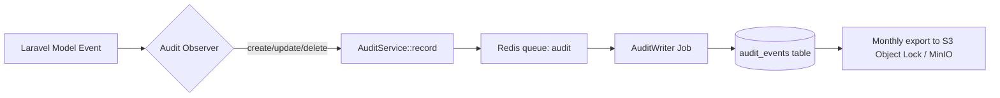

Multi-tenant scope application:

```mermaid
flowchart TD
    Req[HTTP Request] --> Mw[TenantResolver Middleware]
    Mw -->|from subdomain / token| Ctx[TenantContext]
    Ctx --> Eloquent[Eloquent Global Scope: BelongsToTenant]
    Eloquent --> Q[Tenant-scoped query]
    Ctx --> Cache[Redis key: tenant:{id}:...]
    Ctx --> Queue[Queue payload includes tenant_id]
    Ctx --> Storage[Storage path prefix: tenants/{id}/...]
```

#### 0.4.5 Integration points and contracts

- **Atheris Prism wrapper interface** (`App\Contracts\PrismCompletionDriver`) — `complete(PrismRequest $req): PrismResponse`. Drivers: `AnthropicDriver`, `OllamaDriver`. Selected via tenant `hosting_mode`.
- **Audit export contract** — Daily cron compresses audit events to newline-delimited JSON; uploaded to Object Lock with 7-year retention; chain-of-custody hash chain (each file includes SHA-256 of previous).

#### 0.4.6 Security & compliance design

- TLS 1.3 enforced (HSTS preload).
- CSP: `default-src 'self'; script-src 'self'; style-src 'self' 'unsafe-inline' fonts.atheris.ng; connect-src 'self' api.atheris.ng; img-src 'self' data:`.
- Password policy: 12+ characters, complexity, rotated every 180 days, MFA required for any `tenant.*.head`, CISO, CRO, platform roles.
- Audit-trail immutability enforced by: no `UPDATE` / `DELETE` DB privilege on the `audit_events` table for the application DB user; database role `audit_writer` has `INSERT` only.
- NDPA / CBN traceability: Audit-event schema captures tenant, actor, subject, action and retention; NDPA subject-access requests can be resolved via tenant-scoped query.

#### 0.4.7 Air-gapped deployment considerations

- Helm charts include: Laravel app, Redis, MySQL, Meilisearch, MinIO (for evidence vault and backups), OpenTelemetry Collector, Prometheus/Grafana/Loki/Tempo, Ollama (with preloaded model manifest).
- Offline installer script verifies Cosign signatures on every image before apply.
- `helm values.yaml` includes `airGapped: true` flag that disables outbound calls (Anthropic, SecurityScorecard, etc.) and exposes file-import UX for equivalents.

### 0.5 Build Tasks

**Backend**

- [ ] Multi-tenancy audit and migrations (models, scopes, factories)
- [ ] Tenant-resolver middleware and TenantContext binding
- [ ] Audit observer + service + writer job + monthly export
- [ ] Regulatory Reference Library models and seeders (seed with CBN RBCSF, NDPA 2023, NDPR 2019, ISO 27001:2022 Annex A)
- [ ] Feature-flag service and `@feature` blade / `<Feature />` React component
- [ ] Refine Spatie roles + seeders
- [ ] Prism wrapper + Anthropic driver + Ollama driver + canary prompt
- [ ] HTTP security middleware (CSP, HSTS, rate-limit, helmet-equivalent)

**Frontend**

- [ ] Atheris UI Kit package under `packages/ui` with Storybook
- [ ] Design tokens in CSS variables and Tailwind config
- [ ] Avenir Next LT Pro webfont self-hosted (licensed WOFF2)
- [ ] `<Feature />` React wrapper for flag-gated UX
- [ ] `useTenantContext` hook
- [ ] Accessibility lint rules enabled (`eslint-plugin-jsx-a11y`)

**DevOps**

- [ ] GitHub Actions pipeline: lint → test → build → scan (Trivy + gitleaks + SAST) → deploy to staging → E2E → deploy to production
- [ ] Deployment target 1: cPanel (current) via SSH + `artisan deploy` script
- [ ] Deployment target 2: K8s staging (K3s sandbox) via Helm
- [ ] Observability stack in staging
- [ ] Vault on staging
- [ ] Cosign keypair for signing images

**Data / Content-Ops**

- [ ] Seed Regulatory Reference Library with first 200 clauses (CBN RBCSF, NDPA, NDPR, ISO 27001:2022 Annex A)
- [ ] Draft AUCS skeleton of ~40 controls (placeholder — full build in Phase 2)

**Security**

- [ ] Threat model for the platform baseline (STRIDE + LINDDUN)
- [ ] Baseline SAST, SCA, DAST pipelines
- [ ] Secrets rotation runbook

### 0.6 Test Plan

- **Unit (PHPUnit + Pest):** tenant scope, audit observer, Prism wrapper with stub drivers, feature-flag resolver, regulatory reference seeders
- **Unit (Vitest + RTL):** every UI Kit primitive, `useTenantContext`, `<Feature />` wrapper
- **Integration:** every core model save emits an audit event; tenant scope prevents cross-tenant reads; Prism wrapper selects the right driver based on tenant
- **E2E (Playwright):** login; a trivial create + update flow; assert audit rows; MFA enrolment
- **Security:** SAST, SCA, gitleaks, Trivy image scan; DAST baseline against staging; tenant-isolation pentest mini-scope
- **Performance:** baseline k6 run against staging to establish SLO ground truth
- **Regulatory acceptance:** Regulatory Reference Library renders CBN RBCSF clauses with correct clause-path hierarchy
- **UAT scripts:** internal CISO runs through audit-log export, role assignment, MFA enrolment

### 0.7 Exit Criteria / Quality Gate

- [ ] All core models tenant-scoped; cross-tenant read test passes (zero leakage)
- [ ] Audit observer fires on every model event across the 30 core models
- [ ] Audit events exported to Object Lock / MinIO; hash chain verifiable
- [ ] Spatie roles & permissions seeded and enforced
- [ ] Regulatory Reference Library seeded with ≥ 200 clauses
- [ ] Atheris UI Kit Storybook published; every token documented
- [ ] Avenir Next LT Pro self-hosted with documented licensing
- [ ] Prism wrapper hits Claude (SaaS) and Ollama (on-prem) canaries successfully
- [ ] CI/CD green end-to-end to cPanel and K8s staging
- [ ] Observability dashboards live
- [ ] Threat model signed off by CISO
- [ ] Zero critical/high open security findings
- [ ] Content-Ops Lead, AI/Prism Engineer, Security Engineer, QA Lead hired and onboarded
- [ ] At least one Nigerian design-partner bank MOU signed
- [ ] Rollback plan for every Phase 0 migration tested in staging
- [ ] Phase 0 documentation published in MkDocs

### 0.8 Deliverables

- Laravel 11 + React 18 hardened baseline repo with multi-tenancy
- Atheris UI Kit v0.1 (Storybook + NPM package)
- Audit service and event store
- Regulatory Reference Library schema + seed content
- Laravel Prism wrapper (Claude + Ollama drivers)
- CI/CD pipelines (cPanel + K8s)
- Threat model report
- Observability stack (staging)
- Design-partner MOU (first bank)
- Phase 0 documentation set

### 0.9 Team & RACI

| Role | Person (TBD by hire) | RACI |
| --- | --- | --- |
| Product Owner (Platform) | Name 1 | **A** |
| Backend Lead (Laravel) | Name 2 | **R** for multi-tenancy, audit, Prism |
| Frontend Lead (React) | Name 3 | **R** for UI Kit |
| AI/Prism Engineer | Name 4 | **R** for Prism wrapper |
| DevOps / SRE | Name 5 | **R** for CI/CD, observability |
| QA Lead | Name 6 | **R** for test plan |
| Security Engineer | Name 7 | **R** for threat model and security gates |
| Content-Ops Lead | Name 8 | **R** for Regulatory Reference Library seed |
| Design Partner Bank Liaison | Name 9 | **C** — provides feedback; **I** on status |
| CPO | — | **A** overall |
| CTO | — | **C** on architecture |
| CISO (internal) | — | **C** on security |

### 0.10 Estimated Duration

**Calendar:** 4 weeks (weeks 1–4).

**Person-days by role (estimated):**

| Role | Person-days |
| --- | --- |
| Product Owner | 16 |
| Backend Lead | 16 |
| Backend Engineer × 2 | 32 |
| Frontend Lead | 16 |
| Frontend Engineer | 16 |
| AI/Prism Engineer | 14 |
| DevOps/SRE | 16 |
| QA Lead | 14 |
| Security Engineer | 12 |
| Content-Ops Lead | 10 |
| Design | 16 |
| **Total** | **~178 person-days** |

Buffer: 15% built into the above; 4-week calendar holds.

### 0.11 Dependencies

- Anthropic API access (SaaS Prism driver)
- Ollama model pack pre-bundled for air-gapped driver
- Avenir Next LT Pro webfont licensing in place
- Cosign / HashiCorp Vault procurement
- Hiring pipeline for four named roles
- Design-partner bank MOU outreach already underway

### 0.12 Risks & Mitigations

| # | Risk | Owner | Mitigation |
| --- | --- | --- | --- |
| R0-1 | Multi-tenancy backfill on existing dev data corrupts rows | Backend Lead | Dry-run migrations against a staging clone; use reversible data migrations; take full backup before apply |
| R0-2 | Avenir Next LT Pro licensing delays design-system lock | Head of Design | Use Inter as fallback; proceed with token work; swap family on license receipt |
| R0-3 | Content-Ops Lead not hired in time | CPO | Engage a 4-week contractor (Nigerian GRC consultant) to draft the first pack |
| R0-4 | Ollama model footprint too heavy for typical bank on-prem server | AI/Prism Engineer | Default to quantised 7B–14B models; offer GPU or CPU profile; document minimum spec |
| R0-5 | Anthropic API rate limits throttle canary prompts | AI/Prism Engineer | Request production tier; add cached responses for non-tenant prompts; exponential backoff |

---

## Phase 1 — NOW Horizon, Wave 1 (months 0–2)

> Ship CBN-CSAT v1.0 to production, with SSO/SCIM and the public REST API that enterprise buyers demand on the first call.

### 1.1 Objectives

**Business outcomes**

- CBN-CSAT v1.0 live in production with at least two design-partner banks operating on real CBN submission cycles.
- SSO (Entra ID, Okta, Ping) and SCIM v2 unblock every enterprise procurement conversation.
- Public versioned REST API with OpenAPI 3.0 makes Atheris visibly enterprise-ready.

**Technical outcomes**

- CBN-CSAT BRD Phases 1–3 delivered (Institution profile, Inherent Risk Profile engine, Maturity Assessment engine, Approval workflow, Submission package).
- SSO via SAML 2.0 + OIDC; SCIM 2.0 endpoint; MFA-on-SSO.
- Public API under `/api/v1/` with Passport OAuth2; full OpenAPI 3.0 spec at `api.atheris.ng/docs`.

### 1.2 Scope

**In scope**

- CBN-CSAT institution profile module
- 47-question inherent risk engine with 5-level scoring
- 494-statement maturity assessment engine (Yes / No / N/A / Yes[CC])
- Auto-scoring (inherent, maturity, domain, assessment factor, component)
- Compensating-control workflow linked to Issue object stub (full Issue object arrives in Phase 2)
- Narrative forms (Sheet 12 and Sheet 14 equivalents)
- Digital approval workflow (Preparer → CISO → CRO → MD/CEO)
- CBN submission-package export (PDF + Excel)
- Executive CBN-CSAT dashboard with domain heat map and risk-maturity matrix
- SAML 2.0 SSO (Entra ID, Okta, Ping)
- OIDC SSO (Entra ID, Google Workspace)
- SCIM v2 user / group provisioning
- MFA enforcement policy on SSO
- Public API: Passport OAuth2, `/api/v1/` namespace, OpenAPI 3.0 spec, developer portal, rate limits

**Out of scope**

- AI gap analysis (planned for later in CBN-CSAT — Phase 4 surfaces it through Copilot)
- Peer benchmarking (deferred to Phase 5)
- Threats/Vulnerabilities integration beyond CBN-CSAT Sheet 18/19 register (full VM pipeline in Phase 5)
- Connectors to ITSM / scanners (Phase 2/3)

### 1.3 Gaps Addressed

| Gap ref. | Domain / sub-capability | Severity | Priority |
| --- | --- | --- | --- |
| D15.1 | Integrations & APIs — SSO / SCIM | Moderate | P0 |
| D15.4 | Integrations & APIs — Public API | Moderate | P1 |
| D16.1 | UX — Modern, consistent UI (CBN-CSAT showcase) | Minor | P1 |
| — | CBN-CSAT BRD Phases 1–3 full coverage | Category-defining | P0 |

Closes roadmap bullets: *"Launch CBN-CSAT v1.0 production (BRD Phases 1–3)"* and *"Ship SSO/SCIM and public versioned REST API with OpenAPI 3.0"* in the NOW horizon.

### 1.4 Design / Redesign

#### 1.4.1 Data-model changes

CBN-CSAT-specific tables (in `app/Modules/CBNCSAT/Models/`):

- `csat_assessments (id, tenant_id, institution_id, year, cycle, status ENUM('draft','in_review','approved','submitted','archived'), preparer_id, ciso_id, cro_id, ceo_id, readiness_score DECIMAL(5,2), submitted_at, created_at, updated_at)`
- `csat_inherent_responses (id, assessment_id, question_code, level_value TINYINT, comment TEXT, evidence_ids JSON, created_at, updated_at)`
- `csat_maturity_responses (id, assessment_id, statement_code, response ENUM('yes','yes_cc','no','na'), cc_control_id NULL, comment TEXT, evidence_ids JSON, created_at, updated_at)`
- `csat_narratives (id, assessment_id, section ENUM('inherent','maturity'), category_code, body TEXT, ai_draft BOOL DEFAULT 0)`
- `csat_approvals (id, assessment_id, stage, approver_id, decision ENUM('approved','returned'), comment TEXT, decided_at)`
- `csat_threats (id, assessment_id, threat_code, likelihood, impact, mitigating_control_ids JSON, residual_score, comments)`
- `csat_vulnerabilities (id, assessment_id, vulnerability_code, category, likelihood, impact, mitigants_in_place BOOL, existing_mitigants, planned_mitigants, comments)`

SSO/SCIM tables:

- `sso_connections (id, tenant_id, type ENUM('saml','oidc'), idp_metadata TEXT, sp_entity_id, certificate, enabled, created_at, updated_at)`
- `scim_tokens (id, tenant_id, token_hash, scopes JSON, expires_at, created_at)`
- `scim_sync_events (id, tenant_id, operation, subject_type, subject_external_id, payload JSON, result, created_at)`

Public API tables:

- `oauth_*` (Passport-managed)
- `api_tokens` (extended Sanctum-style tokens for server-to-server)
- `api_rate_limits` (if enforced per tenant vs. default)

#### 1.4.2 API contracts

**CBN-CSAT (internal SPA)**

- `POST /api/v1/csat/assessments` → create cycle
- `GET /api/v1/csat/assessments/{id}` → load with nested state
- `PATCH /api/v1/csat/assessments/{id}/inherent/{questionCode}` → set level + comment
- `PATCH /api/v1/csat/assessments/{id}/maturity/{statementCode}` → set response + optional compensating control
- `POST /api/v1/csat/assessments/{id}/approvals/{stage}` → submit approval decision
- `POST /api/v1/csat/assessments/{id}/export?format=pdf|xlsx` → submission package (queued, returns job id, poll /jobs)

**SSO / SCIM**

- `GET /api/v1/auth/saml/{tenant}/metadata` → SP metadata
- `POST /api/v1/auth/saml/{tenant}/acs` → SAML ACS
- `GET /api/v1/auth/oidc/{tenant}/callback` → OIDC code exchange
- `/api/scim/v2/Users`, `/Groups`, `/ServiceProviderConfig` — full SCIM v2 (POST, GET, PATCH, PUT, DELETE)

**Public API**

- `/api/v1/risks`, `/api/v1/controls`, `/api/v1/policies`, `/api/v1/assets`, `/api/v1/incidents`, `/api/v1/vendors`, `/api/v1/vulnerabilities`, `/api/v1/assessments` — full CRUD with pagination, filtering, sparse fieldsets, JSON:API-ish but OpenAPI-described
- OAuth2 via `/oauth/token` with `client_credentials` and `authorization_code` grants
- Rate limits: 600 rpm per token default; 60 rpm for heavy endpoints

OpenAPI spec generated via `knuckleswtf/scribe` with custom descriptions.

#### 1.4.3 UI/UX wireframe descriptions

- **CBN-CSAT Dashboard** — single SPA route `/csat`, navy header with tenant logo, KPI strip (composite inherent risk, domain maturity, readiness score, days to CBN deadline), Risk-Maturity Matrix (interactive 5×5 heat map), Domain radar chart, gap-analysis list, Submission Package CTA gold button.
- **Inherent Risk Profile Screen** — left rail category navigator (5 categories, 47 questions), centre pane with one question at a time showing 5-level criteria cards, right rail with evidence upload and comment thread.
- **Maturity Assessment Screen** — collapsible tree of Domain → Assessment Factor → Component → Maturity Level → Statement; statement panel with response buttons (Yes, Yes[CC], No, N/A), comment thread and evidence picker; Yes[CC] opens a Compensating Control drawer.
- **Approval Workflow Screen** — timeline component with 4 stages; current stage highlighted gold; signatures captured as names + timestamp + IP + user agent.
- **Submission Package Preview** — print-preview pane that mirrors CBN-mandated Excel layout, with per-sheet status; export button triggers the background job.
- **SSO / SCIM admin screens** — under `/admin/identity`; navy header, two tabs (SSO, SCIM); SSO upload / parse IdP metadata; SCIM token generation with scoped permissions.

#### 1.4.4 Workflow / state-machine

CBN-CSAT assessment lifecycle:

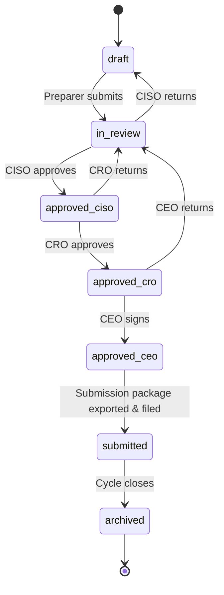

SCIM sync event:

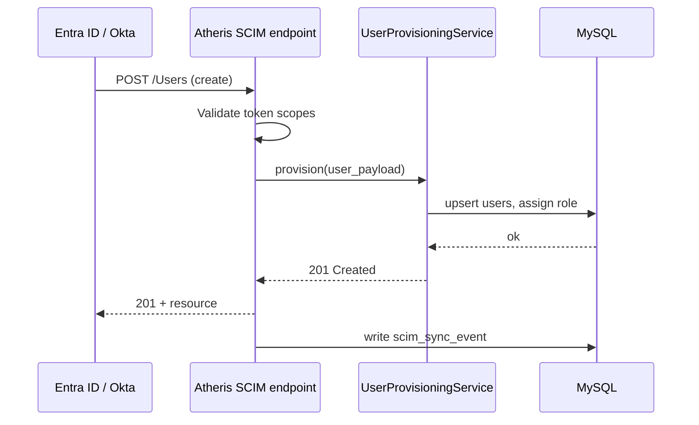

#### 1.4.5 Integration points and contracts

- **Entra ID / Okta / Ping** — SAML 2.0 and OIDC standards
- **Email / SMS notifications** — AWS SES; Infobip or Africa's Talking for SMS (SaaS); SMTP-as-configured for on-prem
- **PDF rendering** — `spatie/browsershot` (Chrome headless) for PDF exports; Excel via `phpoffice/phpspreadsheet`

#### 1.4.6 Security & compliance design

- All CBN-CSAT records tenant-scoped and audited.
- Evidence upload MIME-type allowlisted; virus-scanned (ClamAV) before storage.
- Submission package PDF includes audit metadata (who, when, what cycle).
- SSO/SCIM tokens scoped; rotated; revocable.
- Public API tokens expiry defaults to 90 days; scoped permissions.

#### 1.4.7 Air-gapped deployment

- CBN-CSAT runs identically on-prem; submission package generation tested inside air-gapped K8s with headless Chromium sidecar.
- SSO works with on-prem Entra ID Connect or internal AD FS; OIDC via internal Keycloak accepted.
- SCIM tokens issued locally by on-prem Atheris Admin.
- Public API restricted to bank-internal network by default in air-gapped deployments.

### 1.5 Build Tasks

**Backend**

- [ ] CBN-CSAT module scaffold completed (models, controllers, form requests, policies)
- [ ] Inherent risk question catalogue seed (47 Qs × 5 levels)
- [ ] Maturity statement catalogue seed (494 statements)
- [ ] CBN scoring services (inherent composite, component, assessment factor, domain)
- [ ] Compensating-control workflow stub (unified Issue object in Phase 2)
- [ ] Narrative forms (Sheet 12, Sheet 14 equivalents)
- [ ] Approval workflow with 4 stages
- [ ] Submission package export (PDF via Browsershot, XLSX via PhpSpreadsheet)
- [ ] Readiness score calculator
- [ ] SAML 2.0 via `spatie/laravel-saml`
- [ ] OIDC via `league/oauth2-client`
- [ ] SCIM v2 endpoint (custom controller; RFC 7644 compliant)
- [ ] Passport setup with `client_credentials` grant
- [ ] Scribe-generated OpenAPI spec
- [ ] API rate-limit middleware (tenant-scoped)

**Frontend**

- [ ] CBN-CSAT dashboard page
- [ ] Inherent risk screens
- [ ] Maturity assessment screens (virtualised tree for 494 statements)
- [ ] Approval workflow screens
- [ ] Submission package preview
- [ ] SSO/SCIM admin screens
- [ ] Developer portal for public API (Redoc of the OpenAPI spec)
- [ ] Playwright journeys for CBN-CSAT end-to-end

**DevOps**

- [ ] Browsershot Chromium sidecar in Docker image
- [ ] ClamAV sidecar
- [ ] SAML keypair generation automated per tenant
- [ ] Observability dashboards for CBN-CSAT usage

**Content-Ops**

- [ ] CBN-CSAT question set translation review (versus CBN 2021 workbook)
- [ ] Maturity statement text editorial pass
- [ ] Narrative form prompts and tooltips

### 1.6 Test Plan

- **Unit:** scoring engine (inherent composite, domain maturity cumulative rule, fractional maturity), compensating-control enforcement, SCIM parser, SAML assertion parser
- **Integration:** assessment lifecycle state machine; approval workflow; submission export job
- **E2E Playwright:** CISO-authors-assessment, CRO-approves, CEO-signs, Submission-exports, SSO-login, SCIM-provision
- **Security:** SAML replay / signature tampering; SCIM token scope enforcement; OAuth2 client-secret confidentiality; XSS in comment threads; PII leakage in submission package; file upload exploit scans
- **Performance:** 500 concurrent users editing assessments; p95 API < 400 ms; submission export job < 60 s; maturity tree render < 2 s
- **Regulatory acceptance:**
  - CBN submission package matches the published CBN-CSAT Excel layout byte-by-byte on key sheets
  - Score formulas produce within 0.001 of Excel reference for a regression input set of 50 seed assessments
  - Approval signatures carry actor, timestamp, IP, user agent (CBN examiner accepts)
  - NDPA traceability: export includes DPCO name, processor linkage
- **UAT scripts:** each design-partner bank runs a full assessment cycle against a sanitised prior-year submission

### 1.7 Exit Criteria / Quality Gate

- [ ] 100% of P0 CBN-CSAT test cases passing
- [ ] Inherent and maturity scoring matches Excel reference within 0.001 for the regression set
- [ ] Submission package renders correctly and opens in Microsoft Excel without warnings
- [ ] SAML, OIDC and SCIM v2 verified against Entra ID, Okta, Ping (3×3 matrix)
- [ ] Public API published with OpenAPI 3.0 at `api.atheris.ng/docs`
- [ ] Zero critical/high open security findings (SAST, SCA, DAST, pentest)
- [ ] Performance SLAs met
- [ ] UAT sign-off by two design-partner banks
- [ ] Regulatory traceability matrix covers CBN-CSAT features against CBN RBCSF § 3.9.3, BOFIA § 55–58, NDPA § 24–26
- [ ] User guide, admin guide, API reference published
- [ ] Air-gapped parity: CBN-CSAT passes Playwright suite in air-gapped staging
- [ ] Rollback plan tested (re-deploy Phase 0 baseline in staging and confirm)
- [ ] CHANGELOG and release notes published

### 1.8 Deliverables

- CBN-CSAT v1.0 in production
- SSO & SCIM admin UIs
- Public REST API v1 with OpenAPI 3.0
- Developer portal
- Regulatory traceability matrix rows (CBN § 3.9.3, BOFIA, NDPA)
- Phase 1 test report
- Phase 1 security report
- Signed UAT reports from two design-partner banks

### 1.9 Team & RACI

| Role | RACI (primary) |
| --- | --- |
| Product Owner (CBN-CSAT) | **A** |
| Backend Lead | **R** for CBN-CSAT scoring + SSO/SCIM + Public API |
| Backend Engineers × 3 | **R** for module build |
| Frontend Lead | **A** for CBN-CSAT UX |
| Frontend Engineers × 2 | **R** for screens |
| AI/Prism Engineer | **C** (AI arrives in Phase 4) |
| DevOps / SRE | **R** for Browsershot sidecar, deploy pipeline |
| QA Lead | **A** for test plan |
| QA Engineers × 2 | **R** for Playwright + regression |
| Security Engineer | **R** for SSO/SCIM threat model and pentest |
| Content-Ops Lead | **R** for question set and statements |
| Design Partner Bank Liaison × 2 | **C** |
| CPO | **A** overall |

### 1.10 Estimated Duration

**Calendar:** 8 weeks (months 0–2, running in parallel with the tail of Phase 0).

**Person-days by role:**

| Role | Person-days |
| --- | --- |
| Product Owner | 40 |
| Backend Lead | 40 |
| Backend Engineers × 3 | 120 |
| Frontend Lead | 40 |
| Frontend Engineers × 2 | 80 |
| DevOps / SRE | 24 |
| QA Lead | 32 |
| QA Engineers × 2 | 64 |
| Security Engineer | 24 |
| Content-Ops Lead | 24 |
| Design | 32 |
| **Total** | **~520 person-days** |

Buffer: 15%.

### 1.11 Dependencies

- Phase 0 exit criteria met
- Entra ID, Okta and Ping sandbox tenants for SSO testing
- CBN-CSAT Excel workbook (current CBN 2021 release) as reference
- Design-partner bank test tenants provisioned

### 1.12 Risks & Mitigations

| # | Risk | Owner | Mitigation |
| --- | --- | --- | --- |
| R1-1 | Maturity scoring edge-case mismatch with Excel reference | Backend Lead | Large regression set (≥ 50 assessments); automated comparison; lock formulas behind SCORING_VERSION flag |
| R1-2 | SAML quirks in Entra ID Enterprise Application config | Security Engineer | Reference Entra ID tenant; integration tests; playbook for CISO |
| R1-3 | Submission package formatting drift on different Excel versions | QA Lead | Test on Excel 2019, 2021, 365, LibreOffice |
| R1-4 | Design-partner bank availability for UAT slips | Delivery Manager | Engage bank CISO early; schedule UAT windows in Week 5 of the phase |
| R1-5 | Public API documentation lags code | DevOps / Backend | Scribe runs in CI; PR is blocked if OpenAPI diff is empty |

---

## Phase 2 — NOW Horizon, Wave 2 (months 2–4)

> The big platform wave: asset discovery, the unified Issue object, the Atheris Unified Control Set (AUCS), and the risk-taxonomy / threat-vuln-asset graph.

### 2.1 Objectives

**Business outcomes**

- Atheris acquires its first "platform muscle" beyond CBN-CSAT — asset discovery, remediation management, and a shipped regulatory content set (AUCS) that wins RFPs on feature-compare sheets.
- AUCS becomes the harmonisation spine of the rest of the roadmap.

**Technical outcomes**

- Asset discovery connectors live for AD/Entra, AWS, Tenable, Qualys; Nigerian business-service reference model seeded; business-service / process / product dependency graph shipped.
- Unified Issue object, SLA engine, escalation, Jira and ServiceNow connectors.
- AUCS v1 — ~400 canonical controls mapped to ISO 27001:2022, NIST CSF 2.0, CBN RBCSF, NDPA 2023, PCI-DSS v4.0.1, with African overlays.
- CBN-aligned risk taxonomy + threat–vuln–asset unified graph view.

### 2.2 Scope

**In scope**

- D1 Asset discovery connectors (AD/Entra, AWS, Tenable, Qualys) + bulk CSV importer
- D1 Nigerian business-service reference model and dependency graph
- D7 Unified Issue object (single CAPA record for audit / control test / risk / incident / vulnerability)
- D7 SLA engine with pause/resume + auto-escalation
- D7 Jira and ServiceNow connectors (bi-directional)
- D4 AUCS v1: ~400 canonical controls
- D4 Framework packs: ISO 27001:2022, NIST CSF 2.0, CBN RBCSF, NDPA 2023, PCI-DSS v4.0.1 (African overlays: NDIC, NFIU, CBN IT Standards, CBN Outsourcing)
- D2 CBN-aligned risk taxonomy
- D2 Threat–Vuln–Asset unified graph view (React-Flow)

**Out of scope**

- Continuous Controls Monitoring runner (Phase 3)
- Full FAIR quant (Phase 5)
- Framework version-upgrade wizard (Phase 6)
- Document intelligence / circular parsing (Phase 6)

### 2.3 Gaps Addressed

| Gap ref. | Sub-capability | Severity | Priority |
| --- | --- | --- | --- |
| D1.1 | Asset discovery & auto-population | Critical | P0 |
| D1.2 | Classification & data-owner mapping | Moderate | P0 |
| D1.3 | Business service & dependency graph | Critical | P0 |
| D2.1 | Risk taxonomy | Moderate | P0 |
| D2.3 | Threat–Vuln–Asset linkage | Moderate | P0 |
| D4.1 | Pre-loaded frameworks | Moderate | P0 |
| D4.2 | Mapping engine & overlap view | Critical | P0 |
| D7.1 | Unified Issue object | Moderate | P0 |
| D7.2 | SLA and escalation | Moderate | P0 |
| D7.3 | ITSM integration | Moderate | P1 |

### 2.4 Design / Redesign

#### 2.4.1 Data-model changes

**Asset & business service**

- Extend `assets` with: `criticality_inherited TINYINT NULL`, `source ENUM('manual','ad','aws','tenable','qualys','csv')`, `external_id`, `data_sensitivity JSON`, `cmdb_sync_at TIMESTAMP NULL`
- `business_capabilities (id, tenant_id, name, parent_id NULL, description)`
- `business_services (id, tenant_id, name, capability_id, owner_id, criticality, recovery_time_objective_min, recovery_point_objective_min)`
- `business_processes (id, tenant_id, name, service_id, owner_id, criticality)`
- `service_dependencies (id, source_type ENUM('service','process','asset','vendor'), source_id, target_type, target_id, relation_type)`
- Seeder: Nigerian DMB reference model (channels: USSD, mobile, Internet banking, agent banking, ATM, PoS, WhatsApp banking, cards; services: core banking, NIBSS NIP, Interswitch switch, card issuance; processes: KYC, AML screening, loan origination, etc.)

**Issue object**

- `issues (id, tenant_id, source_type ENUM('audit','control_test','risk','incident','vulnerability','assessment','ndpa_finding'), source_id, title, description, severity ENUM('critical','high','moderate','low'), owner_id, due_date, sla_minutes, sla_paused_minutes DEFAULT 0, status ENUM('open','in_progress','blocked','remediated','verified','closed'), root_cause TEXT, remediation_plan TEXT, external_ticket_id NULL, external_ticket_system NULL, created_at, updated_at)`
- `issue_events (id, issue_id, actor_id, event_type, payload JSON, created_at)` (pause, resume, escalate, link ticket, etc.)
- `issue_sla_policies (id, tenant_id, severity, sla_minutes, escalation_rules JSON)`

**AUCS / framework mapping**

- `aucs_controls (id, code, title, description, domain, sub_domain, objective_text, version, deprecated_at NULL)` — platform-level (no tenant_id; read-only for tenants)
- `framework_clauses (id, framework_code, version, clause_path, title, body_markdown, source_url, effective_date)` — platform-level
- `aucs_framework_mappings (aucs_control_id, framework_clause_id, mapping_strength ENUM('full','partial','related'), mapping_notes)` — platform-level
- `tenant_control_adoptions (id, tenant_id, aucs_control_id, owner_id, implementation_status, effectiveness_rating, evidence_policy)` — tenant-level adoption

**Risk taxonomy + graph**

- `risk_categories` extended with CBN-aligned hierarchy seed (Cyber, Tech, Ops-Tech, TPRM, Data Protection, Physical, Fraud, Regulatory)
- `risk_graph_nodes` / `risk_graph_edges` — materialised view for the React-Flow UI

#### 2.4.2 API contracts

**Asset discovery**

- `POST /api/v1/integrations/ad-entra/sync` — triggered via webhook or schedule
- `POST /api/v1/integrations/aws/sync` — IAM role-based, reads tags
- `POST /api/v1/integrations/tenable/sync` — API token; ingests assets + findings
- `POST /api/v1/integrations/qualys/sync`
- `POST /api/v1/assets/import-csv` — chunked upload; validation job
- `GET /api/v1/business-services` + dependency graph endpoint `/dependency-graph`

**Issue object**

- `GET|POST /api/v1/issues`
- `POST /api/v1/issues/{id}/events/{type}` — pause / resume / escalate / link-ticket
- `POST /api/v1/integrations/jira/issues` — outbound create
- `POST /api/v1/integrations/servicenow/issues` — outbound create
- Webhook receivers: `/api/v1/webhooks/jira`, `/api/v1/webhooks/servicenow` (HMAC-verified)

**AUCS**

- `GET /api/v1/aucs/controls` + `{id}` + `/mappings?framework=iso-27001-2022`
- `GET /api/v1/frameworks/{code}/{version}/clauses`
- `POST /api/v1/tenant/control-adoptions` — tenant adopts an AUCS control

**Risk graph**

- `GET /api/v1/risks/{id}/graph` — returns nodes and edges for the React-Flow component

#### 2.4.3 UI/UX wireframe descriptions

- **Asset Register** — DataTable with filters by source, criticality, data sensitivity; row drawer with tabs (Overview, Dependencies, Controls, Risks, Vulnerabilities, Audit Trail); dependency tab renders a cytoscape.js graph showing upstream business service + downstream vendors / vulnerabilities.
- **Business Service Graph** — full-screen React-Flow canvas; left palette of nodes; ability to drag-drop a new service; auto-layout (dagre); filter by criticality; badge shows upstream assets count.
- **Issue Console** — kanban view (Open / In Progress / Blocked / Remediated / Verified) + list view; SLA countdown per card; "Raise Issue" floating button available on every module; drawer shows linked source (risk/control/incident/vuln).
- **AUCS Browser** — navy-header page with search, left rail of AUCS domains, centre DataTable of controls, right rail with framework cross-mappings as a matrix (columns = frameworks, cells = mapped clauses).
- **Risk Graph View** — risk detail page has a "Graph" tab showing a React-Flow canvas with nodes: Risk (centre), upstream Threats, downstream Assets, mitigating Controls, open Vulnerabilities; edges labelled by relationship type; colour semantics for residual risk.
- **ITSM integration settings** — `/admin/integrations/jira` with form (URL, token, project key, mapping rules); test connection button.

#### 2.4.4 Workflow / state-machine

Issue lifecycle:

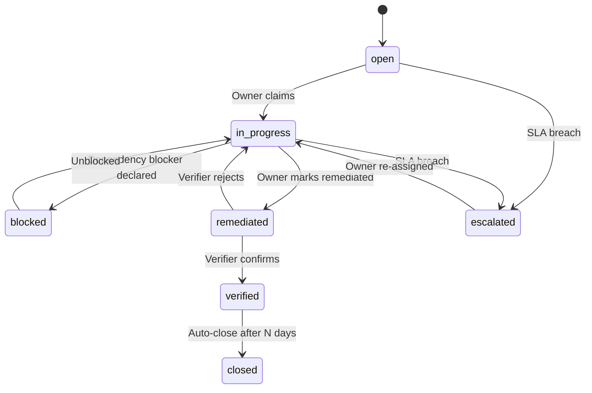

AD/Entra sync flow:

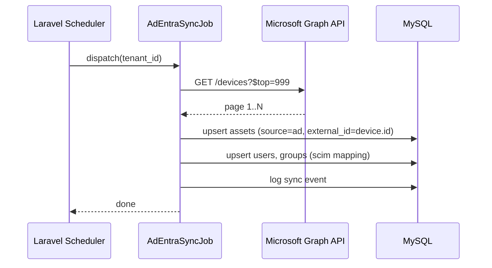

#### 2.4.5 Integration points and contracts

- **Microsoft Graph API** for Entra ID / AD; OAuth2 client credentials; incremental sync with `delta` token
- **Tenable.io / Tenable SC** REST API
- **Qualys VMDR** API v2
- **AWS** cross-account IAM role with read-only permissions on EC2, RDS, S3 tags
- **Jira Cloud REST API** (Basic auth with API token); outbound create and inbound webhook
- **ServiceNow Table API** (OAuth2)
- **Webhook signature**: `X-Atheris-Signature: sha256=<hmac(secret, body)>`

#### 2.4.6 Security & compliance design

- Integration credentials stored in Vault; referenced by alias from `integrations` table
- Scanner ingestion runs under a restricted DB user (INSERT and UPDATE only on `assets`, `vulnerabilities`, `vulnerability_findings`, `issues`)
- AUCS content is read-only to tenants; platform content-ops has separate RBAC
- Issue audit trail captures every state transition, actor and IP

#### 2.4.7 Air-gapped deployment

- AD sync uses on-prem Graph proxy or direct LDAP if Entra not available
- AWS and Tenable cloud ingestion degrade gracefully to CSV/JSON import in air-gapped mode
- Jira Server (on-prem) supported via the same connector with Basic auth
- AUCS shipped as seed data in the air-gapped bundle; quarterly update bundles signed by Atheris

### 2.5 Build Tasks

**Backend**

- [ ] Asset model extensions + source tagging
- [ ] AD/Entra sync job
- [ ] AWS sync job (EC2, RDS, S3, Lambda tagging)
- [ ] Tenable and Qualys sync jobs
- [ ] CSV importer with schema validation
- [ ] Business capability / service / process models + seeders (Nigerian reference model)
- [ ] Dependency graph service
- [ ] Unified Issue model + controllers + policies
- [ ] SLA engine + escalation rules
- [ ] Jira connector (outbound + inbound webhook)
- [ ] ServiceNow connector
- [ ] AUCS tables + import scripts + seeders
- [ ] Framework clauses for ISO 27001:2022, NIST CSF 2.0, CBN RBCSF, NDPA 2023, PCI-DSS v4.0.1, CBN IT Standards, CBN Outsourcing, NDIC
- [ ] AUCS ↔ framework mapping dataset
- [ ] Tenant control-adoption API
- [ ] Risk categories seed
- [ ] Risk graph materialised view

**Frontend**

- [ ] Asset Register DataTable + drawer
- [ ] Business Service Graph (React-Flow)
- [ ] Issue Console (kanban + list)
- [ ] "Raise Issue" action available on every entity detail screen
- [ ] AUCS Browser with framework mapping matrix
- [ ] Risk Graph tab (React-Flow)
- [ ] ITSM integration settings screens

**DevOps**

- [ ] Queue infrastructure for long-running syncs
- [ ] Secrets rotation for integration tokens
- [ ] Observability dashboards per integration

**Content-Ops**

- [ ] AUCS v1 authoring (~400 controls)
- [ ] Framework clause ingestion (ISO, NIST, CBN, NDPA, PCI) with authoritative citations
- [ ] Mapping matrix authoring
- [ ] Nigerian business-service reference model final review

### 2.6 Test Plan

- **Unit:** SLA calculator (pause/resume edge cases, DST), sync dedupe logic, AUCS mapping resolver, risk-graph node/edge builder
- **Integration:** Jira create + webhook round-trip; AD/Entra sync against recorded fixtures; CSV import with 10k rows
- **E2E Playwright:** raise issue from risk → SLA countdown → escalation → Jira ticket → resolve → verify closure
- **Security:** webhook signature verification; integration token scope limits; IDOR on Issue across tenants; CSV importer against malicious payloads (zip-slip, SSRF)
- **Performance:** sync 50k assets in < 15 min; graph renders 500 nodes in < 2 s; AUCS browser lists 400 controls in < 500 ms
- **Regulatory acceptance:**
  - AUCS v1 controls cover 100% of CBN RBCSF controls
  - AUCS v1 mapping traceable to ISO 27001:2022 Annex A, NIST CSF 2.0, PCI-DSS v4.0.1
  - NDPA § 39 processor obligations covered
  - CBN examiner walks through mapping matrix and confirms auditability
- **UAT scripts:** design-partner bank imports its AD estate; runs a risk raise-to-closure against a real incident retrospective

### 2.7 Exit Criteria / Quality Gate

- [ ] Asset discovery connectors live (AD/Entra, AWS, Tenable, Qualys) with design-partner tenant using at least two
- [ ] Nigerian business-service reference model seeded
- [ ] Unified Issue object adopted across Risk, Control, Incident, Vulnerability, Assessment modules
- [ ] SLA engine in production; escalation verified under load
- [ ] Jira and ServiceNow connectors verified with two-way tests
- [ ] AUCS v1 ≥ 400 controls published; all five frameworks mapped
- [ ] Risk taxonomy seeded
- [ ] Risk Graph renders correctly for representative datasets
- [ ] Zero critical/high open security findings
- [ ] Performance SLAs met
- [ ] UAT sign-off by ≥ 2 design-partner banks
- [ ] Regulatory traceability matrix covers AUCS → frameworks → regulator clauses
- [ ] Docs, API reference, and admin guides updated
- [ ] Air-gapped Playwright suite green
- [ ] Rollback plan tested

### 2.8 Deliverables

- Asset discovery connectors
- Nigerian business-service reference model
- Issue object + SLA engine + Jira/ServiceNow connectors
- AUCS v1 content pack
- Framework packs: ISO 27001:2022, NIST CSF 2.0, CBN RBCSF, NDPA 2023, PCI-DSS v4.0.1
- Risk taxonomy seed
- Risk Graph view
- Phase 2 test + security reports
- Phase 2 UAT sign-offs

### 2.9 Team & RACI

| Role | RACI |
| --- | --- |
| Product Owner (Platform) | **A** |
| Backend Lead | **R** for asset discovery, Issue, connectors |
| Backend Engineers × 3 | **R** |
| Frontend Lead | **A** for graph + Issue UX |
| Frontend Engineers × 2 | **R** |
| DevOps / SRE | **R** for sync infrastructure |
| Data Engineer | **R** for AUCS ingestion, framework clause ETL |
| QA Lead | **A** |
| QA Engineers × 2 | **R** |
| Security Engineer | **R** for webhook + token + CSV hardening |
| Content-Ops Lead | **R** for AUCS v1 authoring |
| Content-Ops Editors × 2 | **R** |
| Design Partner Bank Liaison × 3 | **C** |

### 2.10 Estimated Duration

**Calendar:** 8 weeks (months 2–4).

**Person-days by role:**

| Role | Person-days |
| --- | --- |
| Product Owner | 40 |
| Backend Lead | 40 |
| Backend Engineers × 3 | 120 |
| Frontend Lead | 40 |
| Frontend Engineers × 2 | 80 |
| DevOps / SRE | 32 |
| Data Engineer | 40 |
| QA Lead | 32 |
| QA Engineers × 2 | 64 |
| Security Engineer | 24 |
| Content-Ops Lead + 2 editors | 100 |
| Design | 32 |
| **Total** | **~644 person-days** |

Buffer: 15%.

### 2.11 Dependencies

- Phase 1 exit criteria met
- Tenable.io + Qualys sandbox credentials
- Access to Microsoft Graph API test tenant (design-partner bank)
- ServiceNow developer instance
- AUCS content licensing (SCF reference may be used; final text is Atheris-authored)

### 2.12 Risks & Mitigations

| # | Risk | Owner | Mitigation |
| --- | --- | --- | --- |
| R2-1 | AUCS authoring takes longer than 8 weeks due to editorial rigor | Content-Ops Lead | Split authoring into 4 tranches of 100 controls; prioritise CBN coverage; hire external editor if needed |
| R2-2 | Scanner API rate limits throttle large initial sync | Backend Lead | Paged ingestion with backoff; warn user; document minimum cadence |
| R2-3 | Risk Graph performance degrades with > 500 nodes | Frontend Lead | Virtualisation; cluster nodes; progressive disclosure |
| R2-4 | Jira webhook schema drift | Integrations Engineer | Version the adapter; pin to API version; contract tests |
| R2-5 | Design-partner bank AD import reveals data-quality issues we didn't design for | Product Owner | Dry-run import + reconciliation report; configurable mapping rules |

---

## Phase 3 — NOW Horizon, Wave 3 (months 4–6)

> The three moats that make Atheris visibly different at the end of the NOW horizon: Continuous Controls Monitoring with real content, Nigerian KRI pack with board-pack exports, air-gapped deployment and Naira commercial model live.

### 3.1 Objectives

**Business outcomes**

- Atheris CCM Starter Pack (40+ tests for CBN RBCSF, NDPA, PCI-DSS) ships day-one content, not a bespoke project.
- Nigerian KRI Pack (30 KRIs) with one-click board pack gives CROs and CISOs a visible weekly value.
- Air-gapped Kubernetes bundle is productised and at least one Nigerian hosting partnership is announced.
- Three-tier Naira pricebook is live (Essentials / Professional / Enterprise).

**Technical outcomes**

- CCM engine with plug-in test classes and 40+ pre-built tests.
- Evidence vault with S3 Object Lock / MinIO WORM and SHA-256 chain.
- KRI model + auto-population pipeline.
- Board-pack exporter in navy/gold PowerPoint and PDF.
- Air-gapped installer and update bundle.
- Commercial model launched with published Naira pricing.

### 3.2 Scope

**In scope**

- CCM engine (scheduled jobs + plug-in interface)
- 40+ pre-built CCM tests (per CBN RBCSF, NDPA, PCI-DSS)
- Evidence vault (S3 Object Lock / MinIO) with hashing
- KRI model + 30 KRIs + threshold engine + breach alerts
- Board-pack exporter (PowerPoint + PDF) with Atheris navy/gold templates
- Air-gapped Kubernetes bundle: Helm charts, offline image registry, signed updates
- Galaxy Backbone / MainOne / Rack Centre hosting partnership announcement
- Commercial launch: Naira pricebook, three tiers, sales enablement
- Go-to-market kit for design-partner banks

**Out of scope**

- AI copilots (Phase 4)
- Regulatory Intelligence feed (Phase 4)
- Vendor continuous monitoring integration (Phase 4)
- SIEM/SOAR connectors (Phase 5)

### 3.3 Gaps Addressed

| Gap ref. | Sub-capability | Severity | Priority |
| --- | --- | --- | --- |
| D5.1 | Design & operating effectiveness (test plans, sampling) | Moderate | P1 |
| D5.2 | Evidence vault | Moderate | P0 |
| D5.3 | Continuous controls monitoring | Critical | P0 |
| D12.1 | KRI library | Moderate | P0 |
| D12.2 | Dashboards / board & exec views | Moderate | P0 |
| D14.1 | Deployment models (cloud, on-prem, air-gapped) | Minor | P0 |
| D14.2 | Data residency | Minor | P0 |
| D18.1 | List price / pricing model | Minor | P0 |
| D18.3 | Procurement reality (Naira, CAPEX) | Minor | P1 |

### 3.4 Design / Redesign

#### 3.4.1 Data-model changes

- `ccm_tests (id, code, title, description, framework_refs JSON, cadence_cron, default_severity, adapter_key, parameters JSON, active BOOL)` — platform-level templates
- `ccm_tenant_tests (id, tenant_id, ccm_test_id, overrides JSON, status ENUM('enabled','disabled','paused'))`
- `ccm_test_runs (id, tenant_test_id, status ENUM('pass','fail','warn','error'), evidence_ids JSON, output_summary, ran_at, latency_ms)`
- `evidence (id, tenant_id, subject_type, subject_id, file_path, sha256, bytes, mime, retention_until, worm_locked BOOL)`
- `kris (id, tenant_id, code, name, description, category, threshold_green, threshold_amber, threshold_red, direction ENUM('higher_worse','lower_worse'), unit)` — with `kri_readings (id, kri_id, period, value, status)` and `kri_breaches` event table
- `board_pack_templates (id, name, sections JSON, navy_variant BOOL)` + `board_pack_runs (id, tenant_id, template_id, pptx_path, pdf_path, generated_at)`

#### 3.4.2 API contracts

- `GET /api/v1/ccm/tests` / `POST /api/v1/ccm/tenant-tests` / `POST /api/v1/ccm/run/{id}`
- `GET /api/v1/evidence/{id}` (short-lived signed URL; Object Lock metadata exposed)
- `GET /api/v1/kris` / `POST /api/v1/kris/{id}/readings` (usually by job)
- `POST /api/v1/board-packs/generate` (returns job id)

#### 3.4.3 UI/UX wireframe descriptions

- **CCM Console** — list of tests with status chips (green/amber/red), last-run time, next run; detail panel shows run history, evidence thumbnails, failure diagnostics.
- **Evidence Vault Browser** — DataTable of evidence, filters (tenant, subject, retention); detail drawer shows hash, retention-until, WORM lock state.
- **KRI Dashboard** — KPI cards grid; sparkline per KRI; drill-through to readings; breach timeline.
- **Board Pack Generator** — template picker, section toggles, preview (Chromium render), Generate button that queues PPTX + PDF; branded navy/gold output.
- **Pricing page (public marketing + in-app Admin/Billing)** — Essentials / Professional / Enterprise comparison, Naira-first price, USD-equivalent footnote, quarterly instalment option.

#### 3.4.4 Workflow / state-machine

CCM test run lifecycle:

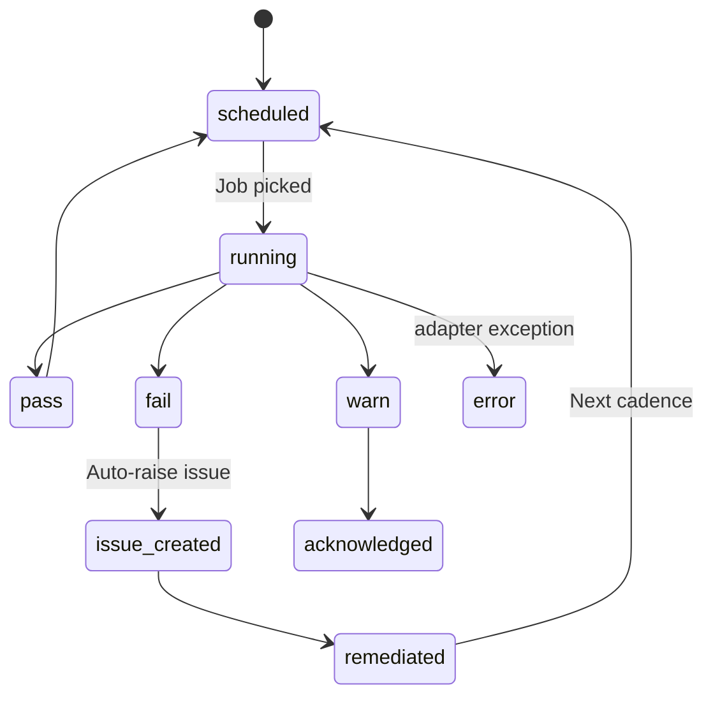

#### 3.4.5 Integration points and contracts

- **CCM adapter contract** (`App\Contracts\CcmAdapter`): `run(CcmTenantTest $t): CcmRunResult` — implementations for AD (MFA coverage, privileged-account count, stale accounts), AWS Config, Microsoft Defender, Tenable, Okta, S3/MinIO (bucket public access), MySQL (SSL enforced), Laravel itself (failed-login alerts).
- **Board-pack rendering** — headless Chromium + Reveal.js or PptxGenJS microservice; Atheris theme variables injected from tenant settings.
- **Object Lock / MinIO WORM** — `s3:PutObjectRetention` with `COMPLIANCE` mode or MinIO object-lock equivalent.

#### 3.4.6 Security & compliance design

- Evidence hashed on upload; hash stored alongside S3 ETag; nightly audit verifies integrity.
- Evidence retention defaults: CBN submission artefacts 7 years; NDPA breach records 5 years; tenant-configurable.
- CCM adapter secrets per tenant in Vault; scoped credentials principle-of-least-privilege.
- KRI breach events write audit rows; notifications routed by role.

#### 3.4.7 Air-gapped deployment

- Helm chart for the air-gapped bundle updated with MinIO, Chromium sidecar, Prism wrapper using Ollama.
- Offline image registry (Harbor or Docker registry) for all container images; Cosign verification.
- Update bundle is a single `.tar` with manifest + images + helm values; signed; customer applies with a single script.

### 3.5 Build Tasks

**Backend**

- [ ] CCM engine core (scheduler, adapter registry, run writer)
- [ ] Adapters: AD/Entra, AWS Config, Defender, Okta, Tenable, MySQL/Postgres SSL, Atheris self-tests
- [ ] 40+ CCM test templates (per CBN RBCSF, NDPA, PCI-DSS)
- [ ] Evidence vault API + S3 Object Lock / MinIO integration
- [ ] Evidence hashing + integrity audit job
- [ ] KRI model + threshold engine + breach events
- [ ] Nigerian KRI Pack seed (30 KRIs covering ATM downtime %, NIBSS NIP failure rate, BEC incidents, EOL AIX count, privileged-access count, MFA coverage %, overdue patches, policy attestation %, etc.)
- [ ] Board-pack generator service

**Frontend**

- [ ] CCM Console
- [ ] Evidence Vault Browser
- [ ] KRI Dashboard
- [ ] Board Pack Generator UX
- [ ] Pricing + Billing screens
- [ ] Accessibility sweep of new screens

**DevOps**

- [ ] Air-gapped Kubernetes bundle (Helm, images, signed updates)
- [ ] Offline installer script
- [ ] Galaxy Backbone / MainOne / Rack Centre hosting partnership integration testing
- [ ] Board-pack rendering sidecar service

**Content-Ops**

- [ ] CCM test template text (each test has rationale, framework linkage, evidence criteria)
- [ ] KRI descriptions and thresholds
- [ ] Board-pack templates (exec summary, risk heat map, KRI panel, top 10 risks, control status, incidents, CBN return readiness)
- [ ] Pricebook copywriting

**Commercial**

- [ ] Three-tier Naira pricebook
- [ ] Order forms and MSA templates
- [ ] Sales enablement kit (demo script, decision-criteria matrix, objection handling)

### 3.6 Test Plan

- **Unit:** CCM adapter contract; evidence hashing; KRI threshold engine; board-pack template renderer
- **Integration:** CCM test against a live AD sandbox, AWS Config, Defender; evidence upload + Object Lock retention; KRI reading pipeline
- **E2E Playwright:** configure tenant test, run on-demand, see failure, auto-created issue, remediate, re-test passes
- **Security:** evidence URL short-expiry; MFA on evidence download for sensitive categories; Object Lock tamper attempt
- **Performance:** 5,000 CCM runs/day per tenant; board-pack generation < 60 s; KRI dashboard render < 2 s
- **Regulatory acceptance:**
  - CCM tests traceable to CBN RBCSF, NDPA, PCI-DSS clauses
  - Evidence retention meets CBN (7-year), NDPA (5-year) minimums
  - Board pack suitable for Board Audit Committee consumption (design-partner bank reviews)
  - KRI pack mapped to CBN IT Standards and NAICOM ERM indicators
- **UAT scripts:** design-partner bank enables 10 CCM tests, generates a board pack, approves pricing tier selection
- **Air-gapped parity:** full CCM suite green in air-gapped staging

### 3.7 Exit Criteria / Quality Gate

- [ ] CCM engine live with ≥ 40 tests deployed to at least one design-partner bank
- [ ] Evidence vault with Object Lock or MinIO WORM verified
- [ ] Hash-chain integrity audit job running nightly
- [ ] KRI pack live with ≥ 30 KRIs auto-populated
- [ ] Board-pack generator producing navy/gold PPTX and PDF
- [ ] Air-gapped installer tested end-to-end on a laptop-scale cluster
- [ ] Update bundle signed and verifiable
- [ ] Galaxy Backbone / MainOne / Rack Centre partnership announced (at least one signed MOU)
- [ ] Three-tier Naira pricebook published (Essentials / Professional / Enterprise)
- [ ] At least one paid Professional-tier win closed
- [ ] UAT sign-off by ≥ 2 design-partner banks
- [ ] Zero critical/high open security findings (including external pentest)
- [ ] Performance SLAs met at 500 concurrent users
- [ ] Rollback plan tested
- [ ] Documentation: CCM authoring guide, air-gapped install guide, pricebook
- [ ] NOW-horizon exit retrospective filed

### 3.8 Deliverables

- CCM engine + 40+ starter tests + content pack
- Evidence vault v1
- Nigerian KRI Pack (30 KRIs)
- Board-pack generator + templates
- Air-gapped Kubernetes bundle v1
- Hosting partnership (at least one signed)
- Three-tier Naira pricebook
- Sales enablement kit
- Phase 3 test + security reports; NOW-horizon retro

### 3.9 Team & RACI

| Role | RACI |
| --- | --- |
| Product Owner (Platform) | **A** |
| Backend Lead | **R** for CCM, evidence vault, KRI |
| Backend Engineers × 3 | **R** |
| Frontend Lead | **A** |
| Frontend Engineers × 2 | **R** |
| DevOps / SRE | **R** for air-gapped bundle + hosting |
| QA Lead | **A** |
| QA Engineers × 2 | **R** |
| Security Engineer | **R** |
| Content-Ops Lead + 2 editors | **R** for CCM test + KRI + board-pack content |
| Commercial Lead | **R** for pricebook + enablement |
| Design Partner Bank Liaison × 3 | **C** |
| VP Partnerships | **R** for Galaxy Backbone / MainOne / Rack Centre |

### 3.10 Estimated Duration

**Calendar:** 8 weeks (months 4–6).

**Person-days by role:**

| Role | Person-days |
| --- | --- |
| Product Owner | 40 |
| Backend Lead | 40 |
| Backend Engineers × 3 | 120 |
| Frontend Lead | 40 |
| Frontend Engineers × 2 | 80 |
| DevOps / SRE | 40 |
| Data Engineer | 16 |
| QA Lead | 32 |
| QA Engineers × 2 | 64 |
| Security Engineer | 24 |
| Content-Ops Lead + 2 editors | 120 |
| Commercial | 32 |
| Design | 24 |
| **Total** | **~672 person-days** |

Buffer: 15%.

### 3.11 Dependencies

- Phase 2 exit criteria met
- AWS S3 Object Lock feature enabled on tenant accounts
- MinIO build for air-gapped
- Galaxy Backbone / MainOne / Rack Centre negotiations in final stages
- Sales enablement collaborative review with commercial leadership

### 3.12 Risks & Mitigations

| # | Risk | Owner | Mitigation |
| --- | --- | --- | --- |
| R3-1 | CCM tests produce false positives that drown CISOs | Product Owner | Conservative defaults; tenant tuning UI; analytics on test precision |
| R3-2 | Object Lock compliance-mode retention causes "stuck" files clients cannot delete | Security Engineer | Tenant-configurable retention; legal review; governance-mode alternative |
| R3-3 | Board-pack rendering differs on LibreOffice / PowerPoint | QA Lead | Target PPTX validated on PowerPoint 365 + LibreOffice; PDF fallback |
| R3-4 | Air-gapped bundle too complex for typical bank infrastructure team | DevOps | Simplified single-file installer; Atheris Field Engineering deployment SLA |
| R3-5 | Hosting partnership talks slip | VP Partnerships | Signal a backup partner; MTN cloud as alternative |

---

## Phase 4 — NEXT Horizon, Wave 1 (months 7–9)

> Atheris Copilot, Atheris Regulatory Intelligence feed and the first vendor continuous-monitoring integration land together — the start of the differentiation horizon.

### 4.1 Objectives

**Business outcomes**

- Atheris Copilot gives every CISO a natural-language assistant that queries risks, controls, policies, incidents and KRIs — the visible AI story that wins bake-offs.
- Atheris Regulatory Intelligence feed becomes a daily habit for Heads of Compliance in Nigeria.
- TPRM capability takes a leap with continuous security-ratings ingestion and a shared Nigerian Vendor Directory that every design-partner can use.

**Technical outcomes**

- Copilot backed by Claude (SaaS) and Ollama (air-gapped) via Laravel Prism; grounded via RAG over AUCS, policies, controls, risks and assessments.
- Regulatory Intelligence feed: crawlers, OCR, LLM summarisation, impact-assessment pipeline; daily cadence; editorial workflow.
- SecurityScorecard + Bitsight API integration; rating refresh on schedule; breach-news watch; Shared Nigerian Vendor Directory seeded.

### 4.2 Scope

**In scope**

- Atheris Copilot v1 — natural-language risk / control / policy queries; Claude on SaaS, Ollama on air-gapped
- RAG index across AUCS, policies, controls, risks, assessments, obligations
- Tool-use pattern: Copilot calls bounded Laravel APIs
- Prompt-injection defences; data egress guardrails; per-tenant logging
- Regulatory Intelligence feed: crawlers for CBN, NDPC, SEC Nigeria, NCC, NAICOM, PENCOM, NDIC; daily ingest
- Editorial review UI for Content-Ops
- Impact-assessment pipeline: clause-to-obligation similarity search; flagged impact to policies / controls / risks
- Obligations library (new `obligations` table)
- SecurityScorecard integration (rating refresh, grade deltas)
- Bitsight integration (second provider)
- Breach-news watch (HaveIBeenPwned, BreachDirectory, custom RSS)
- Shared Nigerian Vendor Directory (Interswitch, NIBSS, CSCS, FMDQ, Unified Payments, e-Tranzact, Teamapt) — seeded DDQ, contact info, baseline controls, Atheris-maintained

**Out of scope**

- SIEM/SOAR connectors (Phase 5)
- FAIR quant (Phase 5)
- Document intelligence / circular parsing with auto-structured extraction (Phase 6)
- CBN return automation beyond CBN-CSAT (Phase 6)

### 4.3 Gaps Addressed

| Gap ref. | Sub-capability | Severity | Priority |
| --- | --- | --- | --- |
| D13.1 | Risk scoring (AI-assisted) | Moderate | P1 |
| D13.2 | Control recommendations | Moderate | P1 |
| D13.3 | Natural-language querying (GRC copilot) | Critical | P1 |
| D11.1 | Regulatory horizon scanning | Critical | P0 |
| D11.2 | Obligations library | Moderate | P0 |
| D11.3 | Change impact | Moderate | P1 |
| D8.3 | Vendor continuous monitoring | Critical | P1 |

### 4.4 Design / Redesign

#### 4.4.1 Data-model changes

- `obligations (id, tenant_id NULL, regulator_code, reference_code, title, body_markdown, effective_date, review_cycle_days, applicability JSON, owner_role, evidence_requirement TEXT)` — platform-seeded obligations + tenant customisations
- `regulatory_circulars (id, regulator_code, circular_number, title, issued_at, ingested_at, source_url, pdf_path, plain_text, llm_summary, impact_assessment JSON, status ENUM('draft','published','superseded'))`
- `circular_impacts (id, circular_id, impacted_type, impacted_id, impact_score, rationale)`
- `tprm_security_ratings (id, vendor_id, provider ENUM('securityscorecard','bitsight','upguard'), rating_value, grade, captured_at, delta_from_previous)`
- `tprm_breach_events (id, vendor_id, event_type, headline, url, discovered_at)`
- `shared_vendor_directory (id, slug, legal_name, category, country, contacts JSON, baseline_ddq_version, updated_at)` — platform-level
- `copilot_conversations (id, tenant_id, user_id, title, mode ENUM('risk','control','policy','general'), created_at)`
- `copilot_messages (id, conversation_id, role ENUM('user','assistant','tool'), content TEXT, tool_name NULL, tool_args JSON NULL, tool_result JSON NULL, tokens_in, tokens_out, model, created_at)`
- `rag_embeddings (id, tenant_id NULL, subject_type, subject_id, chunk_index, embedding VECTOR(1024), content_hash)`

#### 4.4.2 API contracts

**Copilot**

- `POST /api/v1/copilot/conversations` — create
- `POST /api/v1/copilot/conversations/{id}/messages` — user turn; server streams response (SSE)
- Tool endpoints (internal, invoked by Copilot): `POST /api/v1/copilot/tools/risks.search`, `…controls.search`, `…policies.search`, `…incidents.stats`, `…kris.current`, `…aucs.lookup`

**Regulatory Intelligence**

- `GET /api/v1/regulatory/circulars?regulator=cbn&since=...`
- `GET /api/v1/regulatory/circulars/{id}`
- `POST /api/v1/regulatory/circulars/{id}/impact-assessment` — queues analysis
- `GET /api/v1/obligations`
- Editorial: `PATCH /api/v1/regulatory/circulars/{id}` (Content-Ops only; workflow status)

**TPRM CM**

- `POST /api/v1/tprm/security-ratings/refresh` — pulls all vendors
- `GET /api/v1/tprm/vendors/{id}/security-ratings`
- `GET /api/v1/tprm/breach-events?vendor_id=...`
- `GET /api/v1/tprm/shared-directory`

#### 4.4.3 UI/UX wireframe descriptions

- **Atheris Copilot** — chat pane appears as a right-hand drawer (toggle from any page) or a full-page route `/copilot`. Supports slash commands (`/risk Show me overdue critical risks`). Each response cites the records it used (cards with navy header).
- **Regulatory Intelligence Console** — left rail by regulator (CBN / NDPC / SEC / NCC / NAICOM / PENCOM / NDIC); list of circulars with status chips (Unread / Assessed / Actioned); detail pane with plain-text, LLM summary, impacted obligations / policies / controls / risks, editorial approval workflow.
- **Obligations Register** — DataTable by regulator and applicability; detail includes ownership, evidence policy, review cycle, linked circulars, linked controls.
- **TPRM Vendor Card** — now includes security-rating over time, breach events feed, baseline DDQ from Shared Directory, tenant-tier and review cadence.

#### 4.4.4 Workflow / state-machine

Regulatory circular lifecycle:

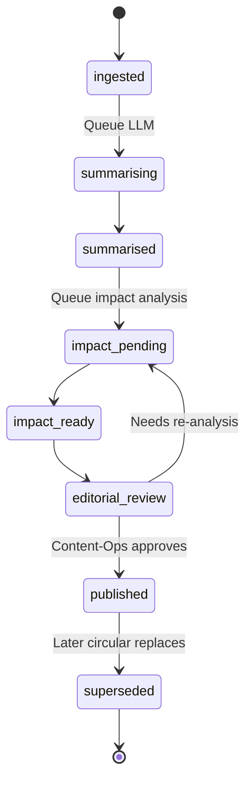

Copilot request:

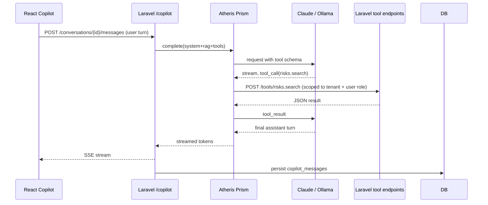

#### 4.4.5 Integration points and contracts

- **Anthropic Messages API** — `claude-sonnet-4-6` primary; `claude-haiku-4-5-20251001` for routing / tool-selection steps
- **Ollama** — `qwen2.5:14b-instruct` primary; `llama-3.1-8b-instruct` fallback
- **Embeddings** — `voyage-context-3` (SaaS) or `bge-m3` via Ollama (air-gapped); stored in `rag_embeddings`
- **SecurityScorecard API** — per-vendor fetch; bulk refresh
- **Bitsight API** — company search + rating
- **Breach watch** — curated RSS bundle (content-ops maintained)
- **Regulator crawlers** — polite bots; robots.txt respect; caching; legal review on each source

#### 4.4.6 Security & compliance design

- **Prompt-injection defences:** system prompt template segregates instructions; user-provided content wrapped; tool schema limits blast radius; response scanned for suspicious outputs (e.g., attempts to exfiltrate data).
- **Data-egress guardrails:** tenant data never sent to a provider the tenant has not opted into (e.g., Anthropic for SaaS; Ollama-only for air-gapped).
- **Per-tenant logging:** every prompt + tool-call + response captured with tenant_id, user_id, tokens, model and content-hash.
- **Content-Ops review** required before any circular goes live to tenants.
- **NDPA traceability:** circular impacts carry citations so a CBN / NDPC examiner can trace the reasoning.

#### 4.4.7 Air-gapped deployment

- Ollama is primary; Copilot works fully offline.
- Regulatory Intelligence in air-gapped mode consumes a signed daily update bundle (produced by Atheris SaaS and delivered via USB or secure file transfer to the bank's update server).
- TPRM SecurityScorecard / Bitsight disabled; Shared Vendor Directory shipped as static pack, refreshed in the same update bundle.

### 4.5 Build Tasks

**Backend**

- [ ] Copilot conversation model + service
- [ ] RAG pipeline (chunk, embed, store, retrieve)
- [ ] Prism driver extensions (streaming tool-use)
- [ ] Tool endpoints (risks, controls, policies, incidents, KRIs, AUCS)
- [ ] Prompt-injection sanitiser
- [ ] Regulatory crawlers (per-regulator adapter)
- [ ] Circular ingest + OCR (Tesseract) + plain-text extraction
- [ ] LLM summarisation job
- [ ] Clause-to-obligation similarity (Voyage / BGE embeddings)
- [ ] Impact-assessment job
- [ ] Obligations library + seed
- [ ] SecurityScorecard client + refresh job
- [ ] Bitsight client + refresh job
- [ ] Breach-news watcher
- [ ] Shared Vendor Directory seed + admin

**Frontend**

- [ ] Copilot drawer + full-page route
- [ ] Streaming SSE hook
- [ ] Citation cards UX
- [ ] Regulatory Intelligence Console (list, detail, impact)
- [ ] Obligations Register
- [ ] TPRM Vendor Card enhancements

**DevOps**

- [ ] Ollama deployment profile (GPU + CPU)
- [ ] Voyage / BGE embedding dependencies
- [ ] Regulator crawler schedule + rate-limit logging

**Content-Ops**

- [ ] Author baseline obligation rows for CBN, NDPC, SEC, NCC, NAICOM, PENCOM, NDIC
- [ ] Editorial workflow training
- [ ] Shared Vendor Directory baseline DDQ
- [ ] Copilot prompt library (few-shot exemplars)

### 4.6 Test Plan

- **Unit:** prompt sanitiser, retrieval ranking, SecurityScorecard client parsing, circular ingest + OCR
- **Integration:** Copilot end-to-end with stub tool endpoints; regulator crawler end-to-end; SecurityScorecard refresh
- **E2E Playwright:** ask Copilot "show me risks with overdue critical issues"; verify result and citations; approve a circular via Editorial workflow
- **LLM-specific:**
  - Prompt-injection corpus (minimum 200 adversarial prompts)
  - Hallucination tests (Copilot must not fabricate record IDs)
  - Precision evaluation on structured Q&A set; target ≥ 90%
- **Security:** tool-endpoint RBAC enforcement; prompt leakage; token accounting for abuse prevention
- **Performance:** first-token < 1.5 s (SaaS), < 5 s (Ollama on reference hardware); circular ingest < 30 min/day for CBN volume
- **Regulatory acceptance:**
  - Circular impact map traceable (circular → obligation → control → policy)
  - Content-Ops approval recorded before publication
  - NDPC / CBN clause-level citation preserved
- **UAT scripts:** design-partner bank CISO uses Copilot for a week; Head of Compliance approves a real circular
- **Air-gapped parity:** Ollama-backed Copilot passes the precision target within 5 percentage points of Claude baseline

### 4.7 Exit Criteria / Quality Gate

- [ ] Copilot precision ≥ 90% on structured eval set (SaaS) and ≥ 85% (air-gapped Ollama)
- [ ] Zero prompt-injection escapes in the red-team corpus
- [ ] Regulatory Intelligence feed ingesting all seven regulators daily
- [ ] Editorial workflow producing published circulars within 24 h of issuance
- [ ] Obligations library seeded for all seven regulators
- [ ] SecurityScorecard and Bitsight integrations in production
- [ ] Shared Nigerian Vendor Directory seeded for 7 anchor vendors
- [ ] Zero critical/high open security findings
- [ ] Performance SLAs met
- [ ] UAT sign-off by ≥ 2 design-partner banks; Head of Compliance approval for Regulatory Intelligence
- [ ] Docs + admin guides + Copilot prompt library
- [ ] Rollback plan tested
- [ ] Air-gapped parity validated

### 4.8 Deliverables

- Atheris Copilot v1 (SaaS + air-gapped)
- Atheris Regulatory Intelligence feed (7 regulators)
- Obligations library
- TPRM continuous monitoring (SecurityScorecard + Bitsight)
- Shared Nigerian Vendor Directory v1
- Phase 4 test + security + red-team reports
- Phase 4 UAT sign-offs

### 4.9 Team & RACI

| Role | RACI |
| --- | --- |
| Product Owner (AI + Regulatory) | **A** |
| AI/Prism Engineer | **R** for Copilot, RAG, prompt-injection defence |
| ML / Content Engineer | **R** for embeddings + retrieval |
| Backend Lead | **R** for tool endpoints, crawlers, TPRM connectors |
| Backend Engineers × 3 | **R** |
| Frontend Lead | **A** for Copilot and Regulatory UX |
| Frontend Engineers × 2 | **R** |
| DevOps / SRE | **R** for Ollama profile + crawler infra |
| QA Lead | **A** |
| QA Engineers × 2 | **R** |
| Security Engineer | **R** for red team + data egress |
| Content-Ops Lead + 3 editors | **R** for obligations + editorial workflow |
| Design Partner Bank Liaison × 3 | **C** |

### 4.10 Estimated Duration

**Calendar:** 12 weeks (months 7–9).

**Person-days by role:**

| Role | Person-days |
| --- | --- |
| Product Owner | 60 |
| AI/Prism Engineer | 60 |
| ML / Content Engineer | 60 |
| Backend Lead | 60 |
| Backend Engineers × 3 | 180 |
| Frontend Lead | 60 |
| Frontend Engineers × 2 | 120 |
| DevOps / SRE | 40 |
| QA Lead | 48 |
| QA Engineers × 2 | 96 |
| Security Engineer | 40 |
| Content-Ops Lead + 3 editors | 240 |
| Design | 40 |
| **Total** | **~1,104 person-days** |

Buffer: 20% (AI work).

### 4.11 Dependencies

- Phase 3 exit criteria met
- Anthropic production tier
- Voyage API account (or BGE self-hosted)
- SecurityScorecard / Bitsight commercial agreements
- CBN / NDPC / SEC / NCC / NAICOM / PENCOM / NDIC crawler legal reviews

### 4.12 Risks & Mitigations

| # | Risk | Owner | Mitigation |
| --- | --- | --- | --- |
| R4-1 | Prompt-injection exfiltrates tenant data | Security Engineer | Bounded tool APIs; output sanitiser; per-tenant kill switch; red-team cadence |
| R4-2 | Ollama latency on typical bank hardware fails SLA | AI Engineer | Quantised models; GPU profile; acceptance of degraded UX with user messaging |
| R4-3 | Crawlers blocked by regulator sites | Content-Ops Lead | Legal communication; fallback manual ingestion; email alert subscriptions |
| R4-4 | Copilot hallucinations erode CISO trust | Product Owner | Citations required; refuse to answer when retrieval is thin; confidence thresholds |
| R4-5 | SecurityScorecard pricing shifts mid-phase | Commercial | Lock-in annual commit; Bitsight as backup |

---

## Phase 5 — NEXT Horizon, Wave 2 (months 9–11)

> Detection integrations, Naira FAIR quantification, and the Nigerian incident notification trifecta (CBN 24h / NDPC 72h / NFIU SAR).

### 5.1 Objectives

**Business outcomes**

- Atheris becomes the only platform that auto-generates CBN 24h advisory, NDPC 72h breach form and NFIU SAR from a single incident record.
- Naira-denominated FAIR with CBN-published loss-frequency data and NDPC fine-band modelling lands a quant story no local competitor can match.
- Vulnerability management leaps from a register to a CBN-aligned SLA engine with EPSS/KEV enrichment and ngCERT advisory ingestion.

**Technical outcomes**

- SIEM/SOAR connectors for Microsoft Sentinel, Splunk ES, QRadar, Wazuh (first-class).
- Incident module with regulatory notification templates and digital signature routing.
- FAIR quant module with 10k+ Monte Carlo iterations, Naira ALE, scenario comparison.
- EPSS/KEV enrichment on vulnerabilities; CBN-aligned SLA engine; ngCERT / NITDA advisory ingestion.

### 5.2 Scope

**In scope**

- SIEM connectors: Microsoft Sentinel, Splunk ES, QRadar, Wazuh (webhook + polling)
- SOAR integration: basic playbooks with Palo Alto XSOAR or Splunk SOAR; Swimlane optional
- Incident notification template pack: CBN 24h, NDPC 72h, NFIU SAR/STR, NAICOM incident note
- Digital signature routing (Preparer → CISO → CRO → CEO) with audit trail
- FAIR quant engine: PERT triangular + lognormal distributions; 10k Monte Carlo; Naira ALE
- NDPC fine-band model (₦ 10m to 2% of turnover)
- Scenario comparison UI (residual risk under varying control effectiveness)
- EPSS + CISA KEV enrichment pipeline
- Vulnerability SLA engine pre-tuned to CBN / ngCERT cadence (Critical < 72 h, High < 14 d, Medium < 30 d, Low < 90 d)
- ngCERT and NITDA advisory ingestion

**Out of scope**

- Document intelligence (Phase 6)
- CBN return automation beyond notification templates (Phase 6)
- Core-banking adapters (Phase 7)

### 5.3 Gaps Addressed

| Gap ref. | Sub-capability | Severity | Priority |
| --- | --- | --- | --- |
| D9.2 | Detection integration (SIEM / SOAR) | Critical | P0 |
| D9.3 | Regulatory notifications (CBN / NDPC / NFIU) | Critical | P0 |
| D2.4 | FAIR / ISO 27005 quant methods | Moderate | P1 |
| D3.2 | Threat-intel feeds (ngCERT, NITDA) | Critical | P1 |
| D3.3 | Exploit prioritisation & SLA | Moderate | P0 |

### 5.4 Design / Redesign

#### 5.4.1 Data-model changes

- `siem_integrations (id, tenant_id, provider ENUM('sentinel','splunk_es','qradar','wazuh'), config JSON, status, last_signal_at)`
- `siem_signals (id, tenant_id, provider, external_id, severity, title, payload JSON, received_at, incident_id NULL)`
- `notification_templates (id, regulator_code, template_key, title, body_template, schema JSON, version)`
- `incident_notifications (id, incident_id, template_key, draft_body, approved_by_id NULL, signed_at NULL, delivery_status ENUM('draft','approved','delivered'), delivery_receipt JSON)`
- `fair_scenarios (id, tenant_id, risk_id, loss_event_description, frequency_distribution JSON, magnitude_distribution JSON, control_effectiveness JSON, iterations INT, created_at)`
- `fair_runs (id, scenario_id, ale_mean_ngn, ale_median_ngn, ale_p95_ngn, ale_p99_ngn, histogram JSON, ran_at)`
- `ndpc_fine_bands (id, band_name, fine_min_ngn, fine_max_ngn, notes)` (seed)
- `epss_cache (cve_id PRIMARY KEY, epss_score DECIMAL(5,4), percentile, updated_at)`
- `kev_cache (cve_id PRIMARY KEY, date_added, known_ransomware_use, updated_at)`
- `vulnerability_sla_policies (id, tenant_id, severity, hours_to_remediate, escalation_rules JSON)`
- `threat_advisories (id, source ENUM('ngcert','nitda','us-cert','au-cert','custom_rss'), advisory_id, title, body, published_at, cves JSON, iocs JSON)`

#### 5.4.2 API contracts

- `POST /api/v1/siem/webhooks/{provider}/{tenant}` — signed webhook
- `POST /api/v1/incidents/{id}/notifications/draft` — LLM-drafts CBN/NDPC/NFIU notification
- `POST /api/v1/incidents/{id}/notifications/{template_key}/approve`
- `POST /api/v1/fair/scenarios` + `POST /{id}/runs`
- `GET /api/v1/fair/scenarios/{id}/runs/{runId}` — ALE stats + histogram
- `GET /api/v1/vulnerabilities/{id}/risk-priority` — CVSS × EPSS × KEV × asset criticality
- `POST /api/v1/vulnerability-sla-policies`

#### 5.4.3 UI/UX wireframe descriptions

- **Incident Console** enriched: timeline pulls SIEM signals; "Notify regulators" button; multi-tab drawer (Summary, Signals, Notifications, Timeline).
- **Notification Drafter** — template picker, LLM-drafted body, schema-driven field completion, preview, signature routing.
- **FAIR Scenario Builder** — guided form for frequency (min/most/max), magnitude, control effectiveness; Run button → histogram with Naira ALE (mean, median, p95, p99).
- **Vulnerability Prioritiser** — DataTable with columns CVSS, EPSS, KEV, Asset criticality, Priority score, SLA countdown; filters by severity; actions: assign, escalate, mark exception.
- **Threat Advisories Feed** — list of advisories with IoCs; one-click pivot to "Am I affected?" (CVE vs. asset inventory).

#### 5.4.4 Workflow / state-machine

Regulatory notification:

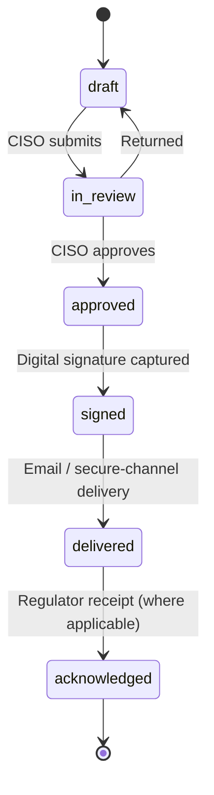

#### 5.4.5 Integration points and contracts

- **Sentinel** — Azure Event Hubs / Logic Apps webhook
- **Splunk ES** — Adaptive Response action posting to Atheris webhook
- **QRadar** — Custom Action + REST webhook
- **Wazuh** — Active Response + HTTP POST integrator
- **EPSS data** — FIRST.org daily CSV
- **CISA KEV** — GitHub JSON
- **ngCERT advisories** — email feed + website
- **NITDA advisories** — website
- **Digital signature** — TrustBridge / Verisign EU Qualified Signature (SaaS) or internal HSM (air-gapped)

#### 5.4.6 Security & compliance design

- SIEM webhooks HMAC-verified; payload size limited; PII redaction rules
- Notification templates include regulator-specific schema and validation (e.g., NDPC 72h form fields)
- FAIR runs are deterministic per seed; seed is logged for reproducibility
- Vulnerability SLA engine writes to Issue object; overdue SLA triggers PagerDuty / OpsGenie-level incident

#### 5.4.7 Air-gapped deployment

- Wazuh already on-prem; first-class
- Sentinel / Splunk / QRadar connectors operate via on-prem gateway
- ngCERT / NITDA advisory feeds arrive via signed update bundle in air-gapped mode
- EPSS / KEV delivered via weekly signed bundle

### 5.5 Build Tasks

**Backend**

- [ ] SIEM connector adapters (Sentinel, Splunk ES, QRadar, Wazuh)
- [ ] Webhook receiver with HMAC + tenant resolver
- [ ] Signal → incident correlation service
- [ ] Notification templates and LLM drafter
- [ ] Signature routing + delivery tracking
- [ ] FAIR engine (PHP — PhpStats or custom Box-Muller Monte Carlo)
- [ ] NDPC fine-band modelling
- [ ] EPSS / KEV cache refresh job
- [ ] Vulnerability SLA engine
- [ ] ngCERT / NITDA ingestion

**Frontend**

- [ ] Incident enrichments
- [ ] Notification Drafter
- [ ] FAIR Scenario Builder + histogram
- [ ] Vulnerability Prioritiser
- [ ] Threat Advisories Feed

**DevOps**

- [ ] Webhook ingress scaling
- [ ] Monte Carlo job queue performance tuning
- [ ] Digital-signature provider integration

**Content-Ops**

- [ ] Author CBN 24h / NDPC 72h / NFIU SAR / NAICOM note templates with regulator-acceptable wording
- [ ] Author vulnerability SLA defaults per severity aligned to CBN/ngCERT expectations

### 5.6 Test Plan

- **Unit:** FAIR Monte Carlo determinism; EPSS parser; SLA countdown
- **Integration:** SIEM webhook round-trip per provider; notification drafter with LLM; signature routing
- **E2E Playwright:** incident raised from SIEM signal → notification drafted → CISO approves → signature → delivery receipt captured
- **Security:** webhook HMAC; signature replay; egress from signed notification PDF (no hidden metadata)
- **Performance:** 10k Monte Carlo iterations < 5 s; 5k/day SIEM signals; vulnerability queue renders 10k rows in < 2 s
- **Regulatory acceptance:**
  - CBN 24h advisory matches CBN advisory format (design-partner CISO review)
  - NDPC 72h breach form passes NDPC field-validation
  - NFIU SAR matches gazetted SAR format
  - Vulnerability SLAs match CBN IT Standards / ngCERT recommendations
  - FAIR outputs traceable to input assumptions; examiner-ready
- **UAT scripts:** design-partner bank exercises a tabletop incident and executes all three notifications
- **Air-gapped parity:** Wazuh-first flow runs in air-gapped staging

### 5.7 Exit Criteria / Quality Gate

- [ ] SIEM connectors live for all four providers; design-partner with at least one in production
- [ ] CBN 24h / NDPC 72h / NFIU SAR / NAICOM notification templates in production with auto-draft + signature
- [ ] FAIR engine produces Naira ALE within ± 1% of reference calculations
- [ ] EPSS + KEV enrichment refreshed daily
- [ ] Vulnerability SLA engine live; overdue escalation verified
- [ ] ngCERT / NITDA advisories ingested daily
- [ ] Zero critical/high open security findings
- [ ] Performance SLAs met
- [ ] UAT sign-off by ≥ 2 design-partner banks; incident tabletop executed
- [ ] Regulatory traceability for notifications updated
- [ ] Docs + playbooks published
- [ ] Rollback plan tested
- [ ] Air-gapped parity validated

### 5.8 Deliverables

- SIEM/SOAR connector suite
- Notification template pack + signature routing
- FAIR Naira quant module
- EPSS/KEV enrichment + vulnerability SLA engine
- ngCERT / NITDA advisory ingestion
- Phase 5 test + security reports + incident tabletop report

### 5.9 Team & RACI

Similar structure to previous phases; emphasise:

- **AI/Prism Engineer** — **R** for notification drafter LLM
- **Backend Lead** — **R** for SIEM + FAIR
- **Security Engineer** — **R** for signature and webhook hardening

### 5.10 Estimated Duration

**Calendar:** 8 weeks (months 9–11).

**Person-days by role:** ~680 total; 20% buffer.

### 5.11 Dependencies

- Phase 4 exit criteria met
- SIEM sandbox access at design-partner banks
- Digital signature provider contract
- Anthropic + Ollama for drafting

### 5.12 Risks & Mitigations

| # | Risk | Owner | Mitigation |
| --- | --- | --- | --- |
| R5-1 | NDPC form schema drift | Content-Ops | Version templates; subscribe to NDPC updates; test quarterly |
| R5-2 | Monte Carlo performance under load | Backend Lead | Queue-isolated workers; deterministic seed; cache repeat runs |
| R5-3 | SIEM provider variety causes connector quality drift | DevOps | Adapter contract tests; standardise signal schema |
| R5-4 | CISO trust in AI-drafted notifications | Product Owner | Drafts always require human approval; template audit trail |
| R5-5 | EPSS/KEV feeds unavailable during outages | Content-Ops | Weekly signed bundle fallback; staleness banner |

---

## Phase 6 — NEXT Horizon, Wave 3 (months 11–12)

> Close the NEXT horizon with document intelligence, full CBN return automation, and the first two Francophone / Lusophone wins.

### 6.1 Objectives

**Business outcomes**

- Atheris becomes the only platform that automates monthly / annual Nigerian regulator returns end-to-end.
- Document intelligence unlocks 10x productivity for Heads of Compliance working through circulars, audit reports and vendor DDQs.
- French and Portuguese UI + Ghana / Kenya regulator packs open pan-African commercial expansion.

**Technical outcomes**

- Document intelligence pipeline (upload → extract → structure → map → suggest actions) with ≥ 95% precision target on circulars.
- CBN return automation: CRMS IT return, annual cyber self-assessment (beyond CBN-CSAT — includes IT-risk questionnaire return), NDPC audit report, NDIC outsourcing notification.
- French and Portuguese translations across all production UI.
- BoG (Ghana) and CBK (Kenya) regulator packs (obligations, circular crawlers, notification templates where applicable).

### 6.2 Scope

**In scope**

- Document intelligence service (upload + OCR + LLM-structured extraction + schema mapping)
- Supported doc types: CBN circular, NDPC decision, audit report, vendor DDQ
- CBN CRMS IT return generator
- CBN annual cyber self-assessment (companion to CBN-CSAT)
- NDPC audit report generator
- NDIC outsourcing notification generator
- Laravel i18n + React i18next French + Portuguese
- BoG Ghana regulator pack (obligations + circulars)
- CBK Kenya regulator pack (obligations + circulars)

**Out of scope**

- Arabic / Swahili (Phase 8)
- SARB / Bank Al-Maghrib packs (Phase 8)
- Core-banking adapters (Phase 7)

### 6.3 Gaps Addressed

| Gap ref. | Sub-capability | Severity | Priority |
| --- | --- | --- | --- |
| D13.4 | Document intelligence | Moderate | P1 |
| D12.3 | Regulator returns (CBN / NDPC) | Critical | P0 |
| D17.1 | Language / UI localisation | Moderate | P1 |
| D17.3 | Regulator packs | Critical | P0 |

### 6.4 Design / Redesign

#### 6.4.1 Data-model changes

- `doc_intelligence_jobs (id, tenant_id, doc_type, source_file, ocr_text, structured_output JSON, confidence, status, reviewed_by_id NULL, created_at, updated_at)`
- `return_templates (id, regulator_code, return_code, name, schema JSON, version, effective_from, navy_variant BOOL)`
- `return_runs (id, tenant_id, template_id, period, status ENUM('draft','approved','submitted'), pdf_path, xlsx_path, csv_path, submitted_at)`
- `translations` managed via file-based JSON resources (not DB) for both Laravel and React

#### 6.4.2 API contracts

- `POST /api/v1/doc-intelligence/uploads` → queues OCR + LLM; returns job id
- `GET /api/v1/doc-intelligence/jobs/{id}` → structured output
- `POST /api/v1/returns/{template_code}/runs` → generate
- `GET /api/v1/returns/{template_code}/runs/{id}` → status + artefacts

#### 6.4.3 UI/UX wireframe descriptions

- **Document Intelligence** — upload drop zone; tabular "Extracted fields" panel; confidence badges; "Send to Circular pipeline" / "Send to Vendor DDQ" buttons
- **Returns Centre** — list of regulator returns with status chips (Draft / Approved / Submitted); click-through to per-return wizard with auto-populated fields and manual overrides
- **Language switcher** in top bar; persists per user

#### 6.4.4 Workflow / state-machine

Document intelligence job:

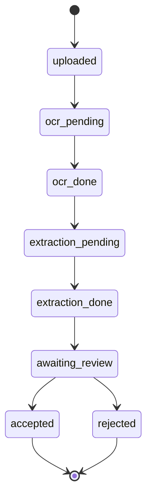

#### 6.4.5 Integration points and contracts

- OCR: Tesseract (air-gapped) + PaddleOCR (multi-script)
- LLM: Claude (SaaS) / Ollama (air-gapped)
- Return submission delivery: email + secure-portal (where regulator provides)

#### 6.4.6 Security & compliance design

- Document uploads virus-scanned
- Extraction outputs include confidence + human-review requirement for < 90% confidence
- Returns captured in immutable submission package (Object Lock 7 years)

#### 6.4.7 Air-gapped deployment

- Document intelligence fully operational on-prem via Tesseract + Ollama; extraction templates shipped in bundle

### 6.5 Build Tasks

**Backend**

- [ ] Document intelligence service + OCR
- [ ] Structured extraction prompts per doc type
- [ ] Review workflow
- [ ] Returns engine (template + run + export)
- [ ] CBN CRMS IT return template
- [ ] CBN annual cyber self-assessment return
- [ ] NDPC audit report template
- [ ] NDIC outsourcing notification template

**Frontend**

- [ ] Document Intelligence screens
- [ ] Returns Centre
- [ ] Language switcher + i18n integration

**Content-Ops**

- [ ] French + Portuguese translations (professional agency review)
- [ ] BoG Ghana obligations + circular source list
- [ ] CBK Kenya obligations + circular source list
- [ ] Extraction schemas per doc type

### 6.6 Test Plan

- Precision/recall on curated doc sets; target ≥ 95% circular extraction accuracy
- Returns validated against regulator schemas
- Translation QA with native speakers
- Air-gapped parity for the entire pipeline

### 6.7 Exit Criteria / Quality Gate

- [ ] Document intelligence ≥ 95% precision on circulars; ≥ 90% on vendor DDQs
- [ ] CBN CRMS IT return; cyber self-assessment; NDPC audit; NDIC outsourcing notifications shipping end-to-end
- [ ] French + Portuguese UI live
- [ ] BoG + CBK packs live
- [ ] Zero critical/high open security findings
- [ ] Performance SLAs met
- [ ] UAT sign-off by ≥ 2 design-partner banks; + 1 Ghana or Kenya reference client
- [ ] Docs + translation notes published
- [ ] Rollback plan tested
- [ ] Air-gapped parity validated
- [ ] NEXT-horizon exit retrospective filed

### 6.8 Deliverables

- Document intelligence v1
- Four CBN/NDPC/NDIC return generators
- Two new language UIs
- Two new regulator packs
- Phase 6 and NEXT-horizon wrap-up reports

### 6.9 Team & RACI

Same structure; add **Translation Vendor** for professional FR/PT review.

### 6.10 Estimated Duration

**Calendar:** 6 weeks (months 11–12). ~500 person-days. Buffer 15%.

### 6.11 Dependencies

- Phase 5 exit
- CBN CRMS IT-return specification obtained
- FR/PT translation vendor engaged

### 6.12 Risks & Mitigations

| # | Risk | Owner | Mitigation |
| --- | --- | --- | --- |
| R6-1 | CBN CRMS schema undocumented | Content-Ops | Engage CBN IT Department; reverse-engineer from bank submissions with permission |
| R6-2 | Translation quality | Head of Localisation | Two-pass agency + native-speaker UAT |
| R6-3 | Document intelligence below precision target for vendor DDQs | AI Engineer | Tighter prompts per DDQ type; human-in-the-loop for low-confidence extracts |
| R6-4 | Ghana / Kenya pack scope creep | Content-Ops Lead | Limit v1 to top 50 obligations per country; iterate |

---

## Phase 7 — LATER Horizon, Wave 1 (months 13–15)

> The moat-building phase: low-code workflows, core-banking adapters and DR runbooks turn Atheris from a GRC system into IT-risk operating infrastructure.

### 7.1 Objectives

**Business outcomes**

- Low-code workflow builder lets banks tailor Atheris without professional-services time — matching LogicGate on configurability while preserving African regulatory depth.
- Unique-in-the-world core-banking adapters make Atheris visibly different on-site at any Nigerian Tier-1 demo.
- DR runbooks (NIBSS failover, switch failover, ATM reroute) speak to the reality of Nigerian bank operations.

**Technical outcomes**

- Low-code workflow builder (Elsa Workflows or Camunda 8) with drag-and-drop conditions, approvers, SLAs.
- Nigerian workflow-template marketplace (CBN ITSM incident, NDPC DPIA, NAICOM breach) bundled.
- Finacle, Flexcube, T24, BankOne read adapters; Interswitch / NIBSS NIP status & metadata ingestion.
- DR runbook engine with exercise orchestration, time-stamped logs, participant attestation.

### 7.2 Scope

**In scope**

- Workflow engine choice (Elsa Workflows 3 vs Camunda 8) — decided via ADR in Phase 6
- Workflow builder UX (React-Flow)
- Workflow runtime and variable binding to domain entities
- CBN ITSM incident, NDPC DPIA, NAICOM breach, NDIC risk finding workflow templates
- Finacle read adapter (via Finacle Connect REST)
- Flexcube read adapter (Oracle APIs)
- T24 read adapter (TAFJ APIs)
- BankOne read adapter (MFB-focused)
- Interswitch / NIBSS NIP read adapters (status + transaction counters, without PII)
- DR runbook engine + Nigerian-specific runbooks
- Exercise orchestration with evidence capture

**Out of scope**

- Arabic / Swahili UI (Phase 8)
- SARB / Bank Al-Maghrib packs (Phase 8)
- Tenant theming + full field customisation (Phase 8)
- SOC 2 / ISO 27001 certification (Phase 8)

### 7.3 Gaps Addressed

| Gap ref. | Sub-capability | Severity | Priority |
| --- | --- | --- | --- |
| D16.2 | Low-code workflow builder | Critical | P1 |
| D15.2 | Core-banking adapters | Moderate | P1 |
| D10.2 | DR test orchestration | Moderate | P1 |
| D10.3 | IT–BC linkage | Moderate | P0 |

### 7.4 Design / Redesign

#### 7.4.1 Data-model changes

- `workflows (id, tenant_id, name, version, definition_json, status)`
- `workflow_instances (id, workflow_id, subject_type, subject_id, state_json, status, started_at, completed_at)`
- `workflow_tasks (id, instance_id, key, assignee_id, due_at, completed_at, outcome)`
- `core_banking_integrations (id, tenant_id, product ENUM('finacle','flexcube','t24','bankone'), config JSON, status)`
- `core_banking_snapshots (id, tenant_id, product, captured_at, artefacts JSON)` (only technical metadata, no customer data)
- `dr_runbooks (id, tenant_id, name, steps JSON, estimated_duration_min, owner_role)`
- `dr_exercises (id, runbook_id, scheduled_at, started_at, finished_at, participants JSON, evidence_ids JSON, outcome_notes)`

#### 7.4.2 API contracts

- `POST /api/v1/workflows` / `POST /api/v1/workflows/{id}/run`
- `GET /api/v1/workflow-instances/{id}` / `POST /api/v1/workflow-tasks/{id}/complete`
- `POST /api/v1/core-banking/integrations/{product}/sync`
- `POST /api/v1/dr/runbooks` / `POST /api/v1/dr/exercises`

#### 7.4.3 UI/UX wireframe descriptions

- **Workflow Studio** — React-Flow canvas; nodes (Start, Task, Decision, Delay, Notification, Integration Call, End); right-rail properties; publish button; versioning
- **Workflow Marketplace** — list of pre-built templates to clone into a tenant
- **Core Banking Settings** — per-product config; test-connection; what data is read (show clearly no customer PII; only technical metadata)
- **DR Runbook Library** — list + editor; runbook detail has steps, owners, dependencies
- **DR Exercise Console** — live session page; participants join via link; step timer; evidence drop zone

#### 7.4.4 Workflow / state-machine

DR exercise:

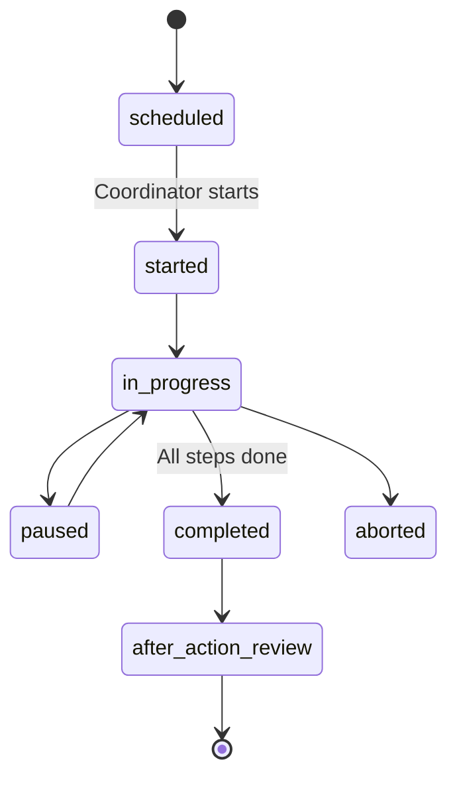

#### 7.4.5 Integration points and contracts

- **Finacle Connect REST** — read-only scopes: product catalogue, branch list, technical health, no customer data
- **Flexcube** — Oracle APIs with tight scopes
- **T24** — TAFJ / T24 web services
- **BankOne** — MFB API
- **Interswitch** — switch status + daily counters
- **NIBSS NIP** — status endpoint

#### 7.4.6 Security & compliance design

- Core-banking adapters explicitly read-only with customer-data embargo
- Every adapter call is audited with query and counts (no raw data)
- DR exercise participant attestation captured with timestamp + IP

#### 7.4.7 Air-gapped deployment

- Workflow engine runs on-prem in the K8s bundle
- Core-banking adapters work on-prem since core systems are already on-prem
- DR runbooks ship as seed content in air-gapped bundle

### 7.5 Build Tasks

**Backend**

- [ ] Workflow engine integration (Elsa / Camunda)
- [ ] Workflow tasks + variable binding
- [ ] Template marketplace
- [ ] Core banking adapters (4 products + 2 switch/NIP)
- [ ] DR runbook + exercise orchestration

**Frontend**

- [ ] Workflow Studio
- [ ] Marketplace UX
- [ ] Core Banking Settings
- [ ] DR Library + Exercise Console

**DevOps**

- [ ] Workflow engine deployment
- [ ] Core banking sandbox credentials handling

**Content-Ops**

- [ ] Workflow templates (CBN ITSM, NDPC DPIA, NAICOM, NDIC)
- [ ] DR runbooks (NIBSS failover, switch failover, core-banking DR, ATM reroute, USSD channel failover)

### 7.6 Test Plan

- Workflow engine load tests (≥ 1,000 concurrent instances)
- Core-banking adapter contract tests + recorded-fixture replay
- DR exercise walkthroughs with design-partner bank
- Air-gapped parity

### 7.7 Exit Criteria / Quality Gate

- [ ] Workflow builder in production; four templates shipped
- [ ] Finacle + Flexcube + T24 + BankOne adapters operational at ≥ 2 design-partner banks
- [ ] Interswitch + NIBSS NIP metadata flowing
- [ ] DR runbook library with ≥ 6 Nigerian runbooks
- [ ] DR exercise orchestration validated with design-partner
- [ ] Zero critical/high open security findings
- [ ] Performance SLAs met
- [ ] UAT sign-off by ≥ 2 design-partner banks
- [ ] Docs published
- [ ] Rollback plan tested
- [ ] Air-gapped parity validated

### 7.8 Deliverables

- Low-code workflow builder + Nigerian template marketplace
- Core-banking read adapters (6 systems)
- DR runbooks (≥ 6)
- Phase 7 test + security reports

### 7.9 Team & RACI

Introduce a **Core-Banking Integrations Engineer** (specialist) **R** for four core-banking adapters; otherwise same pattern.

### 7.10 Estimated Duration

**Calendar:** 10 weeks (months 13–15). ~820 person-days. Buffer 20%.

### 7.11 Dependencies

- Phase 6 exit
- Core banking sandbox access at design-partner banks
- Workflow engine ADR signed off

### 7.12 Risks & Mitigations

| # | Risk | Owner | Mitigation |
| --- | --- | --- | --- |
| R7-1 | Core banking API access denied or delayed | VP Commercial | Engage Vendor of Core (Infosys/Oracle/Temenos) via design-partner bank; ensure read-only scope |
| R7-2 | Workflow engine scope too broad | Product Owner | Limit v1 to Nigerian templates; defer advanced features to Phase 8 |
| R7-3 | DR runbooks expose operational details | Security Engineer | Tenant-scoped templates; classification labels |
| R7-4 | Customer data leakage via adapters | Security Engineer | Hard embargo, contract tests, runtime assertion |

---

## Phase 8 — LATER Horizon, Wave 2 (months 15–18)

> The category-defining wave: pan-African localisation, tenant theming, SOC 2 Type II + ISO 27001, Copilot for board packs & examiner Q&A, and the public Atheris Content Marketplace.

### 8.1 Objectives

**Business outcomes**

- Atheris is now the only ITSRM&G platform with an African regulator footprint across NG / GH / KE / ZA / MA, plus Arabic and Swahili UI.
- Tenant theming + full field-level customisation removes the final LogicGate-style objection.
- SOC 2 Type II + ISO 27001 certification for the hosted environment satisfies every enterprise procurement.
- Atheris Copilot becomes the CISO's board-pack drafter and the CBN examiner's mock interviewer.
- Atheris Content Marketplace creates a network effect with partner-published content (regulatory packs, KRIs, workflows).

**Technical outcomes**

- Arabic (RTL) and Swahili UI
- SARB (South Africa), CBK (Kenya) — already in Phase 6, BoG (Ghana) — already in Phase 6, Bank Al-Maghrib (Morocco) packs
- Tenant theme editor (colour tokens, logo)
- Field-level customisation (custom fields per object, dynamic form rendering)
- Copilot extended: board-pack drafter + CBN examiner Q&A simulator
- SOC 2 Type II + ISO 27001 certification for hosted environment
- Public Atheris Content Marketplace with partner contributions

### 8.2 Scope

**In scope**

- Arabic (RTL) UI
- Swahili UI
- Morocco (Bank Al-Maghrib) pack
- South Africa (SARB) pack
- Tenant theme tokens; logo upload; CSS variable injection
- Custom fields table + dynamic form rendering
- Role-based dashboard configuration
- Copilot board-pack drafter (generates PPTX via template)
- Copilot CBN examiner Q&A simulator (scenario-based testing)
- SOC 2 Type II audit (12-month observation retrospective)
- ISO 27001 certification of the SaaS hosting environment
- Atheris Content Marketplace (publish / discover / install content packs)

**Out of scope**

- Post-GA improvements (tracked in Post-GA Roadmap)

### 8.3 Gaps Addressed

| Gap ref. | Sub-capability | Severity | Priority |
| --- | --- | --- | --- |
| D17.1 | Language / UI localisation | Moderate | P1 |
| D17.3 | Regulator packs (SARB, Bank Al-Maghrib) | Critical | P0 |
| D16.1 | UX tenant-branded themes | Minor | P1 |
| D16.3 | Configurability (field-level) | Moderate | P1 |
| D13.3 | Copilot extensions (board-pack + examiner) | Critical | P1 |
| D14.3 | SOC 2 Type II + ISO 27001 | Moderate | P1 |

### 8.4 Design / Redesign

#### 8.4.1 Data-model changes

- `tenant_themes (id, tenant_id, tokens JSON, logo_path, status)`
- `custom_fields (id, tenant_id, subject_type, key, label, data_type, required, options JSON, order_index)`
- `custom_field_values (id, subject_id, field_id, value)`
- `content_marketplace_items (id, publisher_id, type ENUM('regulator_pack','kri_pack','workflow_template'), slug, version, status, manifest_json, content_bundle_path)`
- `content_installs (id, tenant_id, marketplace_item_id, version, installed_at)`

#### 8.4.2 API contracts

- `POST /api/v1/tenant/theme` → tokens + logo
- `POST /api/v1/custom-fields` / `PATCH /custom-field-values`
- `POST /api/v1/marketplace/items` (publisher) / `GET /api/v1/marketplace/items` / `POST /api/v1/marketplace/installs`

#### 8.4.3 UI/UX wireframe descriptions

- **Theme Editor** — live-preview of platform with theme changes
- **Custom Field Editor** — per-object; drag-to-reorder; data-type palette
- **Copilot Board Drafter** — user selects "Draft this month's BAC pack"; Copilot produces full pack editable in app
- **Copilot Examiner Q&A Simulator** — scenario-based drills (CBN examination, NDPC audit) with scoring
- **Marketplace** — grid of items with version, publisher, install button

#### 8.4.4 Workflow / state-machine

Marketplace install:

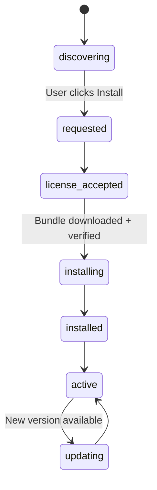

#### 8.4.5 Integration points and contracts

- SOC 2 audit vendor (e.g., A-LIGN, Prescient Assurance)
- ISO 27001 certification body (e.g., BSI, DNV, DQS)
- RTL support via `dir="rtl"` + logical-property CSS

#### 8.4.6 Security & compliance design

- Marketplace bundles signed; Cosign verified before install
- Custom fields encrypted when marked sensitive
- Copilot examiner Q&A never stores answers to regulator questions that could leak

#### 8.4.7 Air-gapped deployment

- Marketplace bundles delivered via signed update bundles
- RTL works identically
- Copilot examiner Q&A uses Ollama

### 8.5 Build Tasks

**Backend**

- [ ] Theme tokens
- [ ] Custom fields + values
- [ ] Marketplace publishing + install
- [ ] Copilot board-pack drafter
- [ ] Copilot examiner Q&A

**Frontend**

- [ ] Arabic RTL + Swahili translations
- [ ] Theme Editor UI
- [ ] Custom Field Editor UI
- [ ] Copilot extensions UX
- [ ] Marketplace UI

**DevOps**

- [ ] SOC 2 evidence automation
- [ ] ISO 27001 ISMS documentation

**Content-Ops**

- [ ] SARB, Bank Al-Maghrib regulator packs
- [ ] Arabic, Swahili translation QA
- [ ] Copilot prompt library for board-pack and examiner scenarios
- [ ] Marketplace initial content (first 10 packs)

**Security / Compliance**

- [ ] SOC 2 Type II audit engagement + 12-month observation
- [ ] ISO 27001 ISMS design + audit

### 8.6 Test Plan

- Full regression in AR + SW (with native speakers)
- Marketplace install/uninstall integrity
- Copilot board-pack and examiner Q&A evaluation set
- Air-gapped parity
- SOC 2 + ISO 27001 evidence completeness

### 8.7 Exit Criteria / Quality Gate

- [ ] Arabic + Swahili UI live
- [ ] SARB + Bank Al-Maghrib packs live
- [ ] Tenant theme editor in production
- [ ] Custom fields available across all primary objects
- [ ] Copilot board-pack drafter in production
- [ ] Copilot examiner Q&A simulator in production
- [ ] SOC 2 Type II audit clean (zero qualified findings)
- [ ] ISO 27001 certification awarded
- [ ] Marketplace live with ≥ 10 initial packs
- [ ] Zero critical/high open security findings
- [ ] Performance SLAs met
- [ ] UAT sign-off by ≥ 3 design-partner banks + ≥ 2 pan-African reference clients
- [ ] Docs published
- [ ] Rollback plan tested
- [ ] Air-gapped parity validated
- [ ] Program-close retrospective filed; Post-GA roadmap handed over

### 8.8 Deliverables

- Pan-African localisation (AR + SW + MA + ZA packs)
- Tenant theming + field-level customisation
- Copilot board-pack drafter + CBN examiner Q&A simulator
- SOC 2 Type II + ISO 27001 certificates
- Atheris Content Marketplace
- Program-close artefacts

### 8.9 Team & RACI

Add **Marketplace Product Owner** and **Audit/Compliance Manager** for SOC 2 / ISO 27001. Content-Ops team sustained.

### 8.10 Estimated Duration

**Calendar:** 14 weeks (months 15–18). ~1,200 person-days. Buffer 20%.

### 8.11 Dependencies

- Phase 7 exit
- SOC 2 + ISO 27001 audit vendor contracts
- Professional translation agency for AR + SW
- Marketplace legal framework (terms of use, publisher agreement, revenue share if any)

### 8.12 Risks & Mitigations

| # | Risk | Owner | Mitigation |
| --- | --- | --- | --- |
| R8-1 | SOC 2 Type II observation window requires hosting environment stability | CISO | Lock hosting changes; document everything; early engagement with auditor |
| R8-2 | Arabic RTL introduces layout regressions | Design Lead | RTL regression suite; dedicated QA; design system RTL audit |
| R8-3 | Marketplace abuse or malicious packs | Security Engineer | Signed bundles; review queue; sandboxed install |
| R8-4 | Copilot board-pack quality below CISO expectation | AI Engineer | Human-in-the-loop editing; template library; per-tenant tone tuning |
| R8-5 | SARB / Bank Al-Maghrib regulator content depth | Content-Ops | Localise via partner firms (Bowmans SA, local Moroccan counsel) |

---

## Post-GA Roadmap (months 18+)

After Phase 8 exit, Atheris transitions to a continuous-delivery operating model. Key ongoing motions:

### Continuous improvement

- Monthly minor releases with bug fixes, connector updates, content refreshes
- Quarterly feature releases aligned to the "Post-GA Themes" (below)
- Annual major release aligned to calendar-year sales motion

### Post-GA themes (first 12 months after GA)

1. **Deeper AI tooling** — automated evidence-collection bots; Copilot task agents (e.g., "complete this questionnaire", "renew these attestations"); retrieval evaluation improvements.
2. **Expanded TPRM** — UpGuard, RiskRecon, and expanded Shared Vendor Directory; 4th-party mapping; vendor lifecycle automation.
3. **Broader regulator coverage** — Rwanda (NBR), Uganda (BoU), Tanzania (BoT), Egypt (CBE), Angola (BNA), Mozambique (BM), Senegal / Côte d'Ivoire via BCEAO.
4. **Cyber resilience** — integrated tabletop exercise platform; crisis communication templates; ransomware-readiness dashboard.
5. **Quantification 2.0** — scenario libraries; real-time FAIR updates from KRI movement; Naira ALE benchmarking across tenants (anonymised).

### Content-pack release cadence

- **CBN / NDPC / NAICOM / NDIC circulars** — daily ingest, 24-hour max lag; published with editorial review inside 48 hours
- **AUCS** — quarterly version releases with delta migration wizard
- **KRI pack** — quarterly additions (target 10 KRIs / quarter)
- **Regulator packs** — 1 new country per quarter post-GA

### Customer Success motion

- Dedicated Customer Success Manager per Enterprise-tier tenant
- Quarterly executive business reviews (QBR) with CROs / CISOs
- Atheris Academy training programme (3 paths: Analyst, Administrator, CISO)
- Pan-African User Conference (annual, Lagos rotating with Nairobi / Cape Town)

### Platform engineering

- Service extraction where bounded-context scale demands (e.g., Regulatory Intelligence as its own service)
- Multi-region SaaS (af-south-1 primary, West Africa as it becomes available)
- 99.95% uptime SLA for Enterprise tier

---

## Appendix A — Gap-Analysis Domain Cross-Reference

| Domain | Primary closure phase | Secondary / reinforcing phases |
| --- | --- | --- |
| D1 Asset & CI Register | Phase 2 | Phase 7 (core-banking adapters extend asset coverage) |
| D2 IT & Cyber Risk Assessment | Phase 2 (taxonomy + graph) | Phase 5 (FAIR) |
| D3 Threat & VM Integration | Phase 5 (EPSS/KEV, SLA, advisories) | Phase 2 (graph linkage) |
| D4 Control Library & Framework Mapping | Phase 2 (AUCS v1) | Phase 8 (marketplace), Phase 6 (new frameworks via packs) |
| D5 Control Testing & Assurance | Phase 3 (CCM, evidence vault) | Phase 4 (Copilot recommends) |
| D6 Policy & Standards Lifecycle | Phase 1 (baseline present), Phase 4 (Copilot assists) | Phase 8 (custom fields) |
| D7 Issue & Remediation | Phase 2 | Phase 5 (vuln SLA), Phase 3 (CCM raises issues) |
| D8 Third-Party / Vendor Cyber Risk | Phase 4 (continuous monitoring + shared directory) | Phase 2 (tiering) |
| D9 Incident & Cyber Event Management | Phase 5 (SIEM/SOAR + notifications) | Phase 1 (incident spine) |
| D10 BC / IT DR Linkage | Phase 7 (DR runbooks) | Phase 2 (business service graph) |
| D11 Regulatory Change Management | Phase 4 (Regulatory Intelligence) | Phase 6 (doc intelligence) |
| D12 KRIs, Dashboards, Exec Reporting | Phase 3 (KRI pack + board packs) | Phase 6 (returns), Phase 8 (Copilot board drafter) |
| D13 AI & Automation | Phase 4 (Copilot v1) | Phase 6 (doc intelligence), Phase 8 (board drafter + examiner) |
| D14 Architecture & Deployment | Phase 3 (air-gapped bundle) | Phase 8 (SOC 2 + ISO 27001) |
| D15 Integrations & APIs | Phase 1 (SSO/SCIM, Public API), Phase 2 (Jira/ServiceNow, scanners, AD) | Phase 7 (core banking) |
| D16 UX / Workflow / Configurability | Phase 0 (design system) | Phase 7 (workflow builder), Phase 8 (theming, custom fields) |
| D17 Localisation | Phase 6 (FR/PT + GH/KE) | Phase 8 (AR/SW + MA/ZA) |
| D18 Pricing & Commercial Model | Phase 3 | Phase 8 (marketplace commercial terms) |

---

## Appendix B — Regulatory Traceability Matrix (template)

Every phase that ships a feature touching controls, policies, incidents, vendors or returns populates rows of this matrix, which is then signed off by the Content-Ops Lead and the Compliance Officer at phase-gate review.

| Feature / module | Atheris record | AUCS control code | Framework clause(s) | Regulator clause(s) | Evidence artefact | Phase |
| --- | --- | --- | --- | --- | --- | --- |
| CBN-CSAT Maturity Engine | `csat_assessments` | AUCS-GOV-01, AUCS-GOV-02 | ISO 27001:2022 A.5, NIST CSF 2.0 GV.OV | CBN RBCSF § 3.9.3; BOFIA § 55–58 | Submission package PDF + XLSX | 1 |
| Unified Issue Object | `issues` | AUCS-CAPA-01 | ISO 27001:2022 A.8.8, NIST CSF RS.CO, PCI-DSS 4.0.1 R3 | CBN IT Standards § 4.2 | Issue audit trail + SLA logs | 2 |
| CCM Starter Pack — MFA Coverage | `ccm_tests` | AUCS-IAM-05 | ISO 27001:2022 A.9, NIST CSF PR.AA | CBN RBCSF § 2.4 | Test run log + evidence hash | 3 |
| CBN 24h Advisory | `incident_notifications` | AUCS-INC-03 | ISO 27001:2022 A.5.25 | CBN ITSM Advisory procedure; NDPC 72h § 32 | Signed PDF + delivery receipt | 5 |
| NDPC 72h Breach Form | `incident_notifications` | AUCS-PRIV-04 | NIST CSF RS.MA-04 | NDPA § 39–41; NDPR § 2.1 | Signed PDF + delivery receipt | 5 |
| FAIR Naira ALE | `fair_runs` | AUCS-RISK-02 | ISO 27005:2022 § 8 | CBN RBCSF risk quantification | Scenario record + histogram | 5 |
| Document Intelligence — Circular | `doc_intelligence_jobs` | AUCS-REG-01 | ISO 27001:2022 A.18 | CBN circular compliance | Job output + Content-Ops sign-off | 6 |
| ... | ... | ... | ... | ... | ... | ... |

---

## Appendix C — Program RACI

Legend: **R** Responsible · **A** Accountable · **C** Consulted · **I** Informed

| Role | P0 | P1 | P2 | P3 | P4 | P5 | P6 | P7 | P8 |
| --- | --- | --- | --- | --- | --- | --- | --- | --- | --- |
| CEO | I | I | I | I | I | I | I | I | I |
| CPO | A | A | A | A | A | A | A | A | A |
| CTO | A | C | C | C | C | C | C | A | C |
| CISO | A | R | R | R | R | R | C | C | A |
| VP Commercial | C | C | C | R | I | I | I | I | R |
| VP Partnerships | I | I | I | R | I | I | I | I | I |
| Product Owner (CBN-CSAT) | C | A | I | I | I | I | I | I | I |
| Product Owner (Platform) | A | R | A | A | R | R | R | R | A |
| Product Owner (AI & Regulatory) | I | I | I | I | A | C | R | I | A |
| Backend Lead | R | R | R | R | R | R | R | R | R |
| Frontend Lead | R | R | R | R | R | R | R | R | R |
| AI/Prism Engineer | R | C | I | C | R | R | R | C | R |
| DevOps / SRE | R | R | R | R | R | R | R | R | R |
| Data Engineer | I | I | R | C | R | C | R | C | C |
| QA Lead | R | R | R | R | R | R | R | R | R |
| Security Engineer | R | R | R | R | R | R | R | R | R |
| Content-Ops Lead | R | R | R | R | R | R | R | R | R |
| Design Lead | R | R | R | R | R | C | C | R | R |
| Design-Partner Bank Liaisons | C | C | C | C | C | C | C | C | C |
| Compliance Officer | C | C | C | C | C | R | R | C | R |
| Auditor (SOC 2 / ISO 27001) | I | I | I | I | I | I | I | C | R |

---

## Appendix D — Build-Session Progress Log (memory-of-build)

> This section is maintained by the Atheris build assistant and survives across sessions. It records which plan items have been translated into working code (migrations, models, routes, controllers, pages, seeders) inside this Laravel 11 + Inertia + React 18 monorepo.

### Session 1 — 2026-04-19 (Demo-data pass, Phases 0–8)

**Phase 0 — Foundations (DONE as demo scaffolding)**
- [x] Migrations: `tenants`, `audit_events`, `regulatory_references`, `regulatory_sources`, `feature_flags`
- [x] Models: `Tenant`, `AuditEvent`, `RegulatoryReference`, `FeatureFlag`
- [x] Design tokens: Tailwind `atheris.navy/gold/green/charcoal` + semantic `critical/warning/success/info`; font stack switched to Avenir Next LT Pro → Inter → Figtree
- [x] Demo data: 3 tenants, 36 feature flags, 11 regulatory reference clauses, 50 audit events

**Phase 1 — CBN-CSAT + SSO/SCIM + Public API (DONE as demo)**
- [x] SSO admin page `/identity/sso` (Entra ID, Okta, Ping seeds)
- [x] SCIM token management page `/identity/scim`
- [x] Public API developer portal `/identity/api` (14 endpoint cards + OAuth2 curl example)
- [x] CBN-CSAT module (pre-existing) retained with its 20+ sub-pages

**Phase 2 — Asset Discovery / Issues / AUCS / Risk Graph (DONE as demo)**
- [x] Migrations: `business_capabilities`, `business_services`, `business_processes`, `service_dependencies`, `issues`, `issue_events`, `aucs_controls`, `framework_clauses`, `aucs_framework_mappings`, `tenant_control_adoptions`, `asset_sync_jobs`
- [x] Models: `BusinessCapability`, `BusinessService`, `BusinessProcess`, `ServiceDependency`, `Issue`, `IssueEvent`, `AucsControl`, `FrameworkClause`, `AucsFrameworkMapping`, `AssetSyncJob`
- [x] Pages: `/aucs`, `/asset-discovery`, `/business-services`, `/business-services/graph`, `/risks-graph`, `/issues`, `/issues/sla-policies`, `/itsm`
- [x] Demo data: **396 AUCS controls across 18 domains**, **46 framework clauses** (ISO-27001, NIST-CSF 2.0, CBN-RBCSF, NDPA, PCI-DSS 4.0.1, CBN-IT-STD, NDIC-OUTSRC, NAICOM-ERM), **773 mappings**, 16 business services with Nigerian DMB channels + core + payments + customer lifecycle + treasury, 15 issues across all source types with SLA policies, 5 asset sync jobs

**Phase 3 — CCM / KRI / Board Packs / Evidence / Pricing (DONE as demo)**
- [x] Migrations: `ccm_tests`, `ccm_tenant_tests`, `ccm_test_runs`, `evidence_vault`, `kris`, `kri_readings`, `kri_breaches`, `board_pack_templates`, `board_pack_runs`, `pricing_tiers`
- [x] Models: `CcmTest`, `CcmTenantTest`, `CcmTestRun`, `EvidenceVaultItem`, `Kri`, `KriReading`, `KriBreach`, `BoardPackTemplate`, `BoardPackRun`, `PricingTier`
- [x] Pages: `/ccm`, `/evidence-vault`, `/kri`, `/board-packs`, `/pricing`
- [x] Demo data: **40 CCM tests** in the CBN/NDPA/PCI starter pack with adapter keys and run history, **30 Nigerian DMB KRIs with 360 weekly readings** across channel, payments, fraud, IAM, vulnerability, governance, resilience, **40 evidence vault items with SHA-256 + 7yr retention + WORM**, 4 board-pack templates × 3 runs each, **3-tier Naira pricebook** (Essentials ₦12m / Professional ₦36m / Enterprise ₦96m)

**Phase 4 — Copilot + Regulatory Intelligence + TPRM CM (DONE as demo)**
- [x] Migrations: `obligations`, `regulatory_circulars`, `circular_impacts`, `tprm_security_ratings`, `tprm_breach_events`, `shared_vendor_directory`, `copilot_conversations`, `copilot_messages`
- [x] Models: `Obligation`, `RegulatoryCircular`, `TprmSecurityRating`, `TprmBreachEvent`, `SharedVendorDirectory`, `CopilotConversation`, `CopilotMessage`
- [x] Pages: `/copilot` (conversation list + chat with slash suggestions + SSE-ready), `/regulatory-intel`, `/regulatory-intel/{circular}`, `/obligations`, `/security-ratings`, `/shared-vendors`
- [x] Copilot POST endpoint returns a demo assistant turn; ready to wire into real Prism driver
- [x] Demo data: 2 Copilot conversations with 4 messages, **15 obligations across 9 regulators**, 10 published circulars with LLM summary + impact assessment, 10 vendor security ratings (SecurityScorecard-style A/B/C/D grades), 6 breach events, **8 Shared Nigerian Vendor Directory entries** (Interswitch, NIBSS, CSCS, FMDQ, Unified Payments, e-Tranzact, TeamApt, Appzone)

**Phase 5 — SIEM / Notifications / FAIR / EPSS-KEV / Advisories (DONE as demo)**
- [x] Migrations: `siem_integrations`, `siem_signals`, `notification_templates`, `incident_notifications`, `fair_scenarios`, `fair_runs`, `ndpc_fine_bands`, `epss_cache`, `kev_cache`, `threat_advisories`, `vulnerability_sla_policies`
- [x] Models: `SiemIntegration`, `SiemSignal`, `NotificationTemplate`, `IncidentNotification`, `FairScenario`, `FairRun`, `ThreatAdvisory`
- [x] Pages: `/siem`, `/notifications`, `/fair`, `/vuln-prioritiser`, `/threat-advisories`
- [x] FAIR "Run Monte Carlo" action creates a deterministic Naira ALE run with 20-bucket histogram
- [x] Demo data: 4 SIEM integrations + 25 signals, 4 notification templates (CBN 24h, NDPC 72h, NFIU SAR, NAICOM), 2 drafted notifications, 4 FAIR scenarios × 1 run each, NDPC fine bands (4 tiers up to 2% of turnover), 5 threat advisories across ngCERT/NITDA/CISA, 20 EPSS + 8 KEV rows, 4 vulnerability SLA policies (72h/14d/30d/90d)

**Phase 6 — Document Intelligence + Returns + i18n + GH/KE packs (DONE as demo)**
- [x] Migrations: `doc_intelligence_jobs`, `return_templates`, `return_runs`
- [x] Models: `DocIntelligenceJob`, `ReturnTemplate`, `ReturnRun`
- [x] Pages: `/doc-intel`, `/returns`
- [x] Upload/generate endpoints seed demo jobs and runs
- [x] Demo data: 8 doc intel jobs across circular / NDPC decision / audit / DDQ, 4 return templates (CBN CRMS IT, Annual Cyber SA, NDPC Audit, NDIC Outsourcing) × 2 runs each (submitted + current draft)

**Phase 7 — Workflow Studio + Core Banking + DR Runbooks (DONE as demo)**
- [x] Migrations: `workflows`, `workflow_instances`, `workflow_tasks`, `core_banking_integrations`, `core_banking_snapshots`, `dr_runbooks`, `dr_exercises`
- [x] Models: `Workflow`, `WorkflowInstance`, `WorkflowTask`, `CoreBankingIntegration`, `CoreBankingSnapshot`, `DrRunbook`, `DrExercise`
- [x] Pages: `/workflows`, `/workflows/marketplace`, `/workflows/instances`, `/core-banking`, `/core-banking/snapshots`, `/dr/runbooks`, `/dr/runbooks/{runbook}`, `/dr/exercises`
- [x] Demo data: 6 published workflows + 6 marketplace templates (CBN ITSM, NDPC DPIA, NAICOM Breach, NDIC Finding, Vendor DDQ, Policy Exception) each with an instance and 7 tasks, 6 core-banking integrations (Finacle/Flexcube/T24/BankOne/Interswitch/NIBSS) with 2 snapshots each, **6 Nigerian DR runbooks** (NIBSS failover, Interswitch failover, Finacle DR, ATM reroute, USSD failover, DC power) × 2 exercises each

**Phase 8 — Marketplace + Theming + Custom Fields + Localisation + SSO (DONE as demo)**
- [x] Migrations: `tenant_themes`, `custom_fields`, `custom_field_values`, `content_marketplace_items`, `content_installs`, `sso_connections`, `scim_tokens`
- [x] Models: `TenantTheme`, `CustomField`, `MarketplaceItem`, `ContentInstall`, `SsoConnection`, `ScimToken`
- [x] Pages: `/marketplace`, `/marketplace/installs`, `/settings/theme`, `/settings/custom-fields`, `/settings/feature-flags`, `/identity/sso`, `/identity/scim`
- [x] Marketplace install endpoint creates a `ContentInstall` record
- [x] Demo data: **10 marketplace items** (CBN 2026 pack, NDPC 2026 pack, Nigerian KRI pack, CBN RBCSF CCM starter, SARB ZA pack, NDPC DPIA workflow, PCI-DSS 4 control pack, BoG GH pack, CBK KE pack, CBN ITSM workflow), 3 active installs, 1 tenant theme, 6 custom fields across Risk/Control/Incident/Vendor/Policy

### Artefacts produced
- **13 new migrations** (all ran cleanly)
- **~40 new Eloquent models**
- **1 consolidated `PlatformController`** with 40+ action methods
- **~35 new Inertia React pages** (Phase 0–8 coverage)
- **3 shared UI primitives**: `PageHeader`, `KpiCard`, `StatusBadge`
- **1 consolidated seeder** `AtherisPlatformSeeder` (wired into `DatabaseSeeder`) that populates every new module
- **Navigation**: `resources/js/Config/navigation.js` now surfaces 21 module groups with phase coverage
- **Vite production build** clean; **53/53 smoke-tested routes return HTTP 200** under an authenticated session

### Verification commands
```bash
php artisan migrate:fresh --seed     # rebuild DB with all demo data
npx vite build                       # confirm no frontend errors
php artisan route:list --except-vendor | grep Platform  # list new routes
```

### Next sessions — suggested work
1. Wire Atheris Prism driver to real Anthropic (Sonnet 4.6) + Ollama (qwen2.5:14b) for Copilot
2. Build real SAML/SCIM endpoints (Passport OAuth2 for public API)
3. Replace SVG stand-in graphs with real React-Flow canvases (add `reactflow` npm)
4. Author proper `database/factories/*` for Risk/Control/Policy/etc. so `migrate:fresh --seed` produces idempotent rich data
5. Add `tenant_id` NOT NULL enforcement migration once backfill is complete
6. Build regulator crawler adapters for Phase 4 (`Services/RegulatoryCrawler/{cbn,ndpc,sec,ncc,naicom,pencom,ndic}.php`)
7. Ship real Playwright E2E suite scaffolded per phase exit-criteria
8. Build air-gapped Helm chart skeleton under `deploy/helm/atheris/`

---

**Document control**

| Version | Date | Author | Summary |
| --- | --- | --- | --- |
| 1.0 | 19 April 2026 | VP Product Delivery | Initial release companion to Gap Analysis v1.0 |
| 1.0-build-log-1 | 2026-04-19 | Atheris Build Assistant (Claude) | Appended Appendix D with Session 1 completed-items log covering Phases 0-8 demo scaffolding |
